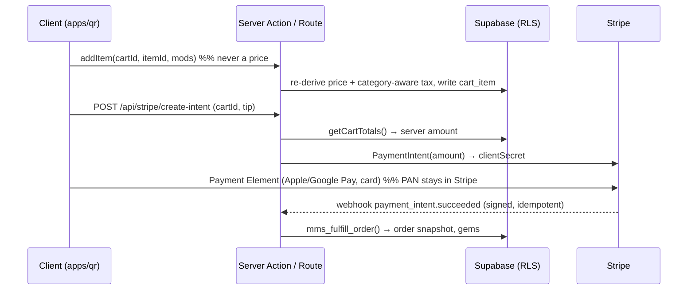

<div align="center">

# ☕ MMS Platform

### Mandalay Morning Star — dine-in QR ordering, pickup & grocery scan-and-go

[](https://github.com/min-hinthar/mms-platform/actions/workflows/ci.yml)
[](https://nextjs.org)
[](https://react.dev)
[](https://www.typescriptlang.org)
[](https://tailwindcss.com)
[](https://turbo.build)
[](https://supabase.com)
[](https://stripe.com)
[](#-license)

**Build:** M0 · M2–M4 · S1–S4 · R1–R9 · J0–J6 ✅ (M1 🟡 — code done, owner-blocked infra tail) — shipped through **W22c** (the gesture layer — a haptic vocabulary, pull-to-refresh, rail overscroll) · **Gate:** 969 qr tests + 87 ui tests · 202 `verify:slice` mutants · **Stack:** $0/mo software (Stripe per-txn only)

</div>

---

## 📑 Table of contents

- [Overview](#-overview)
- [Architecture](#-architecture)
- [Apps & packages](#-apps--packages)
- [Features](#-features)
- [Status & roadmap](#-status--roadmap)
- [Tech stack](#-tech-stack)
- [Quick start](#-quick-start)
- [Environments (Supabase & Stripe)](#-environments-supabase--stripe)
- [Deploy on Vercel](#-deploy-on-vercel)
- [CI, reviews & workflow](#-ci-reviews--workflow)
- [Security & compliance](#-security--compliance)
- [Docs index](#-docs-index)
- [License](#-license)

---

## 🌅 Overview

One Turborepo monorepo for the **QR** half of the Mandalay Morning Star ordering surface. The delivery PWA is a **separate repo** ([`min-hinthar/mandalay-morning-star-delivery-app`](https://github.com/min-hinthar/mandalay-morning-star-delivery-app)) — the two share **one Stripe account** and one design vocabulary, and each runs on **its own Supabase project** (QR owns its catalog on `fasnpdhtvqtzjlvruqcu`; delivery stays on `ukuzkhuppqwtrdkjqrkv`):

- **`apps/qr`** — the in-store app: **Dine-in / Pickup** restaurant ordering, **Grocery Scan & Go** (barcode self-checkout), and the **staff/kitchen** surfaces (KDS · expo · floor · register). Server-authoritative cart, category-aware CA tax, multi-device group cart, Stripe Payment Element.
- **the delivery PWA** — multi-day delivery, live and in **its own repo** (Next 16 · React 19 · Tailwind 4 · Supabase · Stripe · Burmese-gem loyalty). Deliberately **not** in this monorepo: M5 was reshaped 2026-06-24 — QR _learns from_ delivery (its production-hardened mobile/iOS, a11y and motion patterns — [`docs/QR_FROM_DELIVERY.md`](docs/QR_FROM_DELIVERY.md)) instead of absorbing it; co-location is reconsidered at M6.

The QR app began as the productionization of the **v7.2 prototype** (graded ≈4.3/5 against a 10-dimension world-class rubric, hardened across four parallel red-teams) and has since outgrown it — [`docs/DESIGN-LANGUAGE.md`](docs/DESIGN-LANGUAGE.md) is the as-built authority; v7.2 remains the source for verbatim copy on the surfaces it still covers. Design language: **editorial-forward light + “v4 Night” dark**, bilingual EN/Burmese, focus-managed accessibility, SB-1524 transparency.

### 🎨 Design language (as-built, M1 → W22)

The doctrine every build/review arc has proved out lives in [`docs/DESIGN-LANGUAGE.md`](docs/DESIGN-LANGUAGE.md) — the warm editorial-paper aesthetic, the lit-gold **selection vocabulary** shared by every chip/pill/seal, the motion idiom kit (`mms-pop` / `mms-rise` / `mms-stagger`, all reduced-motion-escorted), the **optimistic-UX doctrine** (instant flip · serialized background writes · revert-to-confirmed · drain-before-charging · amounts never optimistic), hard **honesty rules** (rank seals only from real paid-order counts, tie-aware; recommendations state the literal rule they matched; copy promises only what the code keeps), always-bilingual EN + Burmese on one surface, and receipt-language money surfaces.

**Depth & ceremony (W22a, as-built):** every `.card` reads as gently-lifted warm paper — an inset `--sheen` lip over the two-tier `--sh-paper` (tight ambient + a **negative-spread** wide diffuse; a zero-spread wide layer reads as a hard square frame), hover deepening through `--sh-paper-hover` and never flattening back. Diner mains ride `PaperAmbient` — a fixed `z:-1` gradient-masked hairline grid + gold bloom + grain, print-hidden, with the page ground on `<html>` **only** and the host never isolating (an `isolation:isolate` host traps its own fixed overlays under the app header). Pages carry LINES, cards carry DOTS (`.card-textured`); `.surface-vellum` marks moments of consideration; glass frost is `md:`+ on the sticky chrome and mobile stays opaque and blur-free — the GPU budget is a hard limit. Two ceremonies pay off real events: the `/track` paid summary is a thermal slip that **prints on** when freshly paid (the print-head light a sibling of the clipped element, never a child), and Send-to-kitchen lands a paper beat — both `display:none` under reduced motion. Still ahead in [`docs/W22_DESIGN_PROPOSAL.md`](docs/W22_DESIGN_PROPOSAL.md) (W22a + W22b ✅ shipped): the gesture layer, designed Night mode, honest personalization, and an opt-in sound identity.

## 🏗 Architecture

```mermaid
graph TD
  subgraph apps
    Q[apps/qr<br/>dine-in · pickup · grocery · staff]
  end
  subgraph packages
    UI[@mms/ui<br/>tokens · Sheet · primitives · motion hooks]
    DB[@mms/db<br/>Supabase clients · generated types · Zod schemas]
    CFG[@mms/config<br/>ESLint + Prettier preset]
  end
  Q --> UI
  Q --> DB
  Q --> CFG
  DB --> SUPA[(Supabase<br/>Postgres + RLS + Realtime)]
  Q --> STRIPE[[Stripe<br/>PaymentIntent + webhook]]
  Q --> RESEND[[Resend<br/>receipt + staff email]]
  Q --> PH[[PostHog<br/>funnel · flags]]
  D[delivery PWA<br/>separate repo] -. shares Stripe + design vocabulary .-> Q
```

**Order → pay (server-authoritative):**



The client **never computes a price**; the server re-derives every amount from the menu row + validated modifiers. Group ordering rides **private Supabase Realtime channels authorized by RLS** off a short-lived table-session JWT. Full spec in [`docs/ARCHITECTURE.md`](docs/ARCHITECTURE.md).

## 📦 Apps & packages

| Workspace        | What                                                                                                                                            | Status                                                                                                                         |
| ---------------- | ----------------------------------------------------------------------------------------------------------------------------------------------- | ------------------------------------------------------------------------------------------------------------------------------ |
| `apps/qr`        | QR dine-in/pickup + grocery scan-and-go, and the staff/kitchen surfaces                                                                         | ✅ shipped through W22r — server cart · Stripe · group cart + split-tender · rewards · KDS/expo/floor/register/tips · receipts |
| `@mms/ui`        | tokens (editorial light + Night) · Sheet/Card/Badge/Avatar/Stepper/Skeleton/EmptyState/Icon · motion + interaction hooks · NumberFlow re-export | ✅ in use                                                                                                                      |
| `@mms/db`        | Supabase clients (browser/server/service) · generated types · Zod schemas — migrations live in `supabase/migrations/`                           | ✅ in use                                                                                                                      |
| `@mms/config`    | the shared ESLint + Prettier preset every workspace extends                                                                                     | ✅ in use                                                                                                                      |
| _(delivery PWA)_ | its own repo — QR only **learns from** it (M5 reshaped 2026-06-24)                                                                              | ↗ [`mandalay-morning-star-delivery-app`](https://github.com/min-hinthar/mandalay-morning-star-delivery-app)                    |

## ✨ Features

**Restaurant (Dine-in / Pickup)** — mode picker · skeleton-loaded menu (RSC) · **"Start here" = two independently drifting 10-card rows** (row A the real paid-order ranking with tie-aware seals, or the hand-set `popular` fallback while history is thin; row B "a little of everything" — a category round-robin that is a curation rule, not a ranking, so it never wears a seal). The drift rides the native scroller and is a guest in the diner's scroll: it pauses on touch/hover/focus, offscreen, on a hidden tab and for 2.2s after any scroll it didn't write, carries a visible pause/play control (WCAG 2.2.2), and `prefers-reduced-motion` gets the exact static rail with no duplicate DOM · **"Explore your Burmese taste buds"** — one bilingual pill bar holding both vocabularies: craving pills that recommend (every card states the literal rule it matched) beside the dietary pills that filter the whole menu, with the fail-safe free-from disclaimer travelling with the pills wherever they render · item modifiers + curated pairings · optimistic add → stepper · number-roll totals · per-person split + split-tender · group cart + host lock · promo codes · honest pickup slots · **itemized live tracker** · Morning Star Rewards · order history + reorder · emoji feedback + ungated review triage · bilingual EN/MY · light/Night themes.

**Grocery Scan & Go** — phone-camera **barcode scanning** (native `BarcodeDetector` + `@zxing` fallback) · UPC catalog · category-aware tax (food exempt / retail taxable) · **EBT-eligibility tags** (SNAP checkout = 2027 / Forage) · kiosk + handheld-scanner ready. See [`docs/GROCERY_SCANGO.md`](docs/GROCERY_SCANGO.md).

**Receipts, email & live tracking** — one brand identity module (`apps/qr/lib/brand.ts`) feeds all three, so an address or a phone number is never re-typed. The **durable receipt** is a zero-JS server component: badge lockup, destination group headings ("At your table / To-go / Grocery", only when the basket spans two or more), per-line kitchen notes, the pickup contact name, and an identity foot with 44px `tel:` / `mailto:` targets — every figure the fulfillment-time snapshot, rendered verbatim. The **receipt email** carries a hosted true-PNG badge (the app's own logo is WebP bytes behind a `.png` name — email clients can't decode it), a "Mingalabar · မင်္ဂလာပါ" kicker, a three-cell **solid** triad bar (clients drop gradients), a plain-text part rendered from the same element, `replyTo`, and a per-template honest reason line. **Live tracking** reads through one shared select + mapper, so the tracker lists lines in the same order as the durable receipt: a full itemized slip with groups, mods, notes and zero-gated breakdown rows, a status label that never claims "Paid in full" on a refund, the SB-1524 disclosure whenever a fee row shows, and real per-step times — "In the kitchen" stays bare, because no honest clock for it exists.

**Staff & kitchen** — KDS · expo · floor board · table detail + add-to-table · approvals · orders · register (cash + kiosk tip) · tips reporting (unattributable settles reported as a shared bucket, never an invented per-head split) · team + staff auth/lock · a `board` view and a `kiosk` mode.

**Platform** — server-authoritative cart + pricing · **category-aware CA tax** (one 10.5% Covina rate; CDTFA Reg 1603/80-80 decides _what_ is taxable — hot/prepared + retail always, cold food dine-in only, grocery staples exempt — TS `lib/tax.ts` and SQL `mms_line_tax` pinned in parity by tests) · Stripe Payment Element (SAQ-A) · multi-device group cart (Realtime + RLS) · PostHog funnel · CSP/security headers · WCAG-grade accessibility.

## 📊 Status & roadmap

Tracked in [`ROADMAP.md`](ROADMAP.md) (milestones → phases → tasks) and the [GitHub Project board](https://github.com/min-hinthar/mms-platform/projects). Changelog: [`CHANGELOG.md`](CHANGELOG.md).

| Milestone                            | Scope                                                                                                         | State                                      |
| ------------------------------------ | ------------------------------------------------------------------------------------------------------------- | ------------------------------------------ |
| **M0** Scaffold                      | monorepo, RLS migration, tax fn, server cart, Stripe routes, Realtime hook, grocery scan, CI/reviews          | ✅ done                                    |
| **M1** Walking pay path              | sign table-session JWT · Payment Element + cart-create · authz Server Actions · webhook reconcile · nonce CSP | 🟡 P1.0–P1.6 ✅ (owner-blocked infra left) |
| **M2** Tax + promos + scheduling     | server promos · honest pickup slots · grocery sessions · QBO sync                                             | ✅ P2.1–P2.4                               |
| **M3** Group cart                    | table session + RLS + Realtime presence + host lock (multi-device) · split-tender · abuse limits              | ✅ done                                    |
| **M4** Rewards & account             | Morning Star Rewards (QR-local, mirrors delivery's ladder) · redemption · history/reorder · ungated feedback  | ✅ P4.1–P4.3                               |
| **M5** QR learns from delivery       | repos stay separate (reshaped 2026-06-24) — adopt delivery's mobile/a11y/motion patterns + shared primitives  | 🟡                                         |
| **M6** Kiosk + Terminal + EBT (2027) | Stripe Terminal · Forage EBT · handheld scanner                                                               | ⬜                                         |
| **Tracks** S · R · J · W             | S1–S4 service model · R1–R9 richness · J0–J6 journey · W5–W22r polish arcs — see [`ROADMAP.md`](ROADMAP.md)   | ✅ through W22r                            |

> **Gate before "done" (every change, not just a milestone):** `pnpm verify:slice` green · `pnpm check:docs` green · CI green · the adversarial + Codex rounds addressed · the QA-checklist items the change touches ticked ([`docs/context/QA-CHECKLIST.md`](docs/context/QA-CHECKLIST.md), progress in [`docs/REVIEW.md`](docs/REVIEW.md)) · `ROADMAP.md` box checked · `CHANGELOG.md` line added · [`docs/OPEN-ITEMS.md`](docs/OPEN-ITEMS.md) swept · preview smoke-tested. Start any session with [`docs/HANDOFF.md`](docs/HANDOFF.md), then [`docs/context/INDEX.md`](docs/context/INDEX.md) (decisions · rubric · red-team · v7.2 prototype).

## 🧰 Tech stack

Next.js 16 (App Router, RSC, Server Actions) · React 19 · TypeScript strict · Tailwind v4 · Turborepo + pnpm · Supabase (Postgres · RLS · Realtime · Auth) · Stripe (Payment Element + webhooks) · Resend + React Email · framer-motion · `next-view-transitions` · Zustand · Serwist (PWA) · PostHog (free tier) · Radix UI · `@number-flow/react` (re-exported from `@mms/ui`) · `@zxing/library` · Vitest. The **$0/month free stack** is documented in [`docs/context/FREE-KIT-MAP.md`](docs/context/FREE-KIT-MAP.md).

## 🚀 Quick start

```bash
corepack enable && corepack prepare pnpm@11.7.0 --activate
pnpm install
cp .env.example apps/qr/.env.local           # fill in Supabase / Stripe / PostHog (see below)
supabase db push                              # or paste supabase/migrations/*.sql then supabase/seed.sql in the SQL editor
pnpm dev                                       # apps/qr on http://localhost:3000
```

The gate — run all three before any PR:

```bash
pnpm turbo lint typecheck build test   # what CI runs
pnpm verify:slice                      # the MECHANICAL money-path gate: coverage guard + 202 semantic
                                       # mutations (each MUST turn its owning suite red) + orphan check.
                                       # ⚠️ rewrites the 38 money/authority modules it mutates IN PLACE
                                       # (37 under apps/qr/lib + create-share-intent/route.ts) and restores
                                       # them. It ABORTS if a target file is DIRTY, so commit first.
pnpm check:docs                        # GFM table parity (prettier INTRODUCES the breaks) + live-state
                                       # doc counts MEASURED via `vitest list`, never transcribed
```

A surviving mutant means the fixture is degenerate, not that the mutant is wrong — find inputs that separate the two code paths. A stale mutant is a failure too, not a skip.

One-shot repo + CI bootstrap (creates a **public** repo → unlimited Actions, links Turbo cache):

```bash
bash setup.sh
```

## 🔐 Environments (Supabase & Stripe)

**QR runs on its own Supabase project** (`fasnpdhtvqtzjlvruqcu`) and **shares the Stripe account** with the delivery app. QR owns its catalog (menu, modifiers, grocery, `tax_category`) — it does **not** reach into the delivery DB. Manage keys **per environment**:

|                                | Supabase                                                          | Stripe                                                                                    |
| ------------------------------ | ----------------------------------------------------------------- | ----------------------------------------------------------------------------------------- |
| **Production** (Vercel `main`) | live project · service-role + `SUPABASE_JWT_SECRET` (server-only) | **live** keys `sk_live_…` · the QR app's **own** webhook endpoint → its **own** `whsec_…` |
| **Preview / Dev** (PRs, local) | a **Supabase branch** or dev project — never migrate prod blindly | **test** keys `sk_test_…` · test webhook secret                                           |

Two rules:

1. **Never DDL production directly.** Validate migrations on a **staging project** (Supabase branching needs Pro), review the RLS, then promote. Migrations live in `supabase/migrations/`.
2. **QR owns its catalog.** The QR project holds its own `menu_categories`/`menu_items`/`modifier_*`/`grocery_items` (with `tax_category` as a column), seeded from `supabase/seed.sql`. Loyalty / account-link with the delivery side is an M4 concern, not a shared-DB dependency.

Set values in **Vercel → Project → Settings → Environment Variables** (scoped Production/Preview/Development) and never commit them (`.gitignore` excludes `.env*`). Full list in [`.env.example`](.env.example).

## ▲ Deploy on Vercel

One Vercel **Project per app**. Import `mms-platform` and set **Root Directory = `apps/qr`** — the only app in this repo (the delivery PWA deploys from its own). Vercel auto-detects Turborepo; [`apps/qr/vercel.json`](apps/qr/vercel.json)'s `turbo-ignore` skips a build when the app didn't change. Push to `main` = production; every PR = a preview URL. Details: [Vercel monorepos](https://vercel.com/docs/monorepos/turborepo).

## 🤖 CI, reviews & workflow

| Workflow                                                               | Trigger   | Does                                                                                                                                                                                                                                                                  |
| ---------------------------------------------------------------------- | --------- | --------------------------------------------------------------------------------------------------------------------------------------------------------------------------------------------------------------------------------------------------------------------- |
| [`ci.yml`](.github/workflows/ci.yml)                                   | PR / push | **build** — orphan-suite guard + `turbo run lint typecheck build test` (cached) · **migrations-check + types-fresh** — boots the local Supabase stack, applies every migration + seed, proves the generated types aren't stale, runs the SQL tests (RLS · tax parity) |
| [`require-docs-update.yml`](.github/workflows/require-docs-update.yml) | PR        | pre-merge gate — a PR touching `apps/**` or `packages/**` must also touch `docs/**`, `CHANGELOG.md`, `ROADMAP.md` or `README.md` (opt out with the `skip-docs` label)                                                                                                 |
| [`ensure-preview.yml`](.github/workflows/ensure-preview.yml)           | PR        | safety net — force a Vercel preview if the GitHub→Vercel webhook drops the commit                                                                                                                                                                                     |

**The review is in-session, not in CI.** No workflow here runs a Claude review — the `review` / `security` / `adversarial-pr` stub checks that once existed only to satisfy branch protection have been **retired**, so the three workflows above are the whole of CI. The real gate, in order: `pnpm verify:slice` + `pnpm check:docs` (mechanical, zero tokens — `check:docs` also runs inside `ci.yml`, so a stale count fails the PR), then ONE fresh-context adversarial subagent over the diff (its verdict posted as a PR comment for the record), plus **two Codex rounds** — `@codex review` on the draft, round 2 on the fix commits — fix-or-justify both, then merge and file anything left in [`docs/OPEN-ITEMS.md`](docs/OPEN-ITEMS.md). Calibration for the in-session pass lives in [`.github/claude-review-prompt.md`](.github/claude-review-prompt.md). **Quality:** ESLint + Prettier + knip via a shared `@mms/config` preset (`pnpm lint` / `pnpm format` / `pnpm knip`). **Claude Code** in this repo is configured by [`CLAUDE.md`](CLAUDE.md) + [`.claude/`](.claude) (settings, a post-edit auto-format hook, session-memory hooks, `LEARNINGS`/`ERROR_HISTORY`) and [`.mcp.json`](.mcp.json) (Supabase / GitHub / Sentry MCP). Day-to-day loop: [`docs/WORKFLOW.md`](docs/WORKFLOW.md). Contributing + templates: [`.github/`](.github).

## 🛡 Security & compliance

Server-authoritative pricing (no client-trusted amounts) · Supabase **RLS** on every table + private Realtime · Stripe **PCI SAQ-A** (PAN only in Stripe's iframe) · server-validated promos · CSP/security headers · **SB-1524** service-charge disclosure · **never** surcharge debit · **EBT/SNAP deferred to 2027** (Forage + FNS, 50%-rule). Pre-launch gate: [`docs/REVIEW.md`](docs/REVIEW.md) + the QA checklist.

## 📚 Docs index

**Start here:** [`docs/HANDOFF.md`](docs/HANDOFF.md) (the durable pickup point) · [`docs/context/INDEX.md`](docs/context/INDEX.md) (decisions · rubric · QA gate · red-team · v7.2 prototype) · [`docs/OPEN-ITEMS.md`](docs/OPEN-ITEMS.md) (the single open-work registry)

**Reference:** [`docs/ARCHITECTURE.md`](docs/ARCHITECTURE.md) · [`docs/BACKEND_ARCHITECTURE.md`](docs/BACKEND_ARCHITECTURE.md) · [`docs/DESIGN-LANGUAGE.md`](docs/DESIGN-LANGUAGE.md) · [`docs/W22_DESIGN_PROPOSAL.md`](docs/W22_DESIGN_PROPOSAL.md) · [`docs/MOTION_AND_PERF.md`](docs/MOTION_AND_PERF.md) · [`docs/QR_FROM_DELIVERY.md`](docs/QR_FROM_DELIVERY.md) · [`docs/GROCERY_SCANGO.md`](docs/GROCERY_SCANGO.md) · [`docs/ENV.md`](docs/ENV.md) · [`docs/WORKFLOW.md`](docs/WORKFLOW.md) · [`docs/REVIEW.md`](docs/REVIEW.md)

**History:** [`ROADMAP.md`](ROADMAP.md) · [`CHANGELOG.md`](CHANGELOG.md)

## 📄 License

Private © Mandalay Morning Star LLC. The repo is public for free CI/Actions and transparency; the code is not licensed for reuse.
