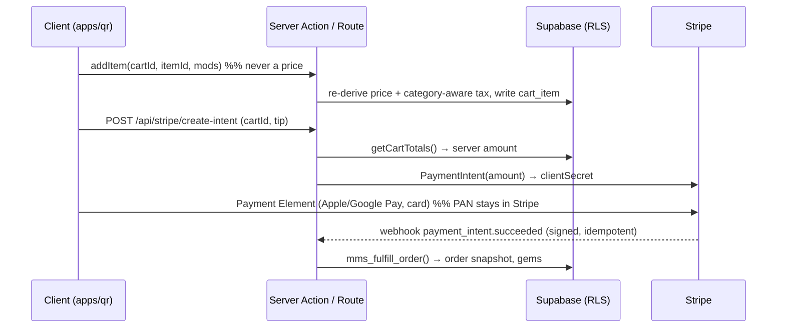

<div align="center">

# ☕ MMS Platform

### Mandalay Morning Star — delivery, dine-in QR ordering & grocery scan-and-go, in one monorepo

[](https://github.com/min-hinthar/mms-platform/actions/workflows/ci.yml)
[](https://github.com/min-hinthar/mms-platform/actions/workflows/claude-review.yml)
[](https://nextjs.org)
[](https://react.dev)
[](https://www.typescriptlang.org)
[](https://tailwindcss.com)
[](https://turbo.build)
[](https://supabase.com)
[](https://stripe.com)
[](#-license)

**Build:** M0 scaffold ✅ · **Grade:** design ≈4.3/5 (world-class rubric) · **Stack:** $0/mo software (Stripe per-txn only)

</div>

---

## 📑 Table of contents

- [Overview](#-overview)
- [Architecture](#-architecture)
- [Apps & packages](#-apps--packages)
- [Features](#-features)
- [Status & roadmap](#-status--roadmap)
- [Tech stack](#-tech-stack)
- [Quick start](#-quick-start)
- [Environments (Supabase & Stripe)](#-environments-supabase--stripe)
- [Deploy on Vercel](#-deploy-on-vercel)
- [CI, reviews & workflow](#-ci-reviews--workflow)
- [Security & compliance](#-security--compliance)
- [Docs index](#-docs-index)
- [License](#-license)

---

## 🌅 Overview

One Turborepo monorepo for the whole Mandalay Morning Star ordering surface — **one Stripe account, one design system**, with **each app on its own Supabase project** (QR owns its catalog on `fasnpdhtvqtzjlvruqcu`; the live delivery app stays on `ukuzkhuppqwtrdkjqrkv`):

- **`apps/delivery`** — the existing multi-day delivery PWA (Next 16 · React 19 · Tailwind 4 · Supabase · Stripe · Burmese-gem loyalty · v1.9 launch-ready). Migrated in; reused, not rebuilt.
- **`apps/qr`** — the new in-store app: **Dine-in / Pickup** restaurant ordering **and** **Grocery Scan & Go** (barcode self-checkout). Server-authoritative cart, category-aware CA tax, multi-device group cart, Stripe Payment Element.

The QR app is the productionization of the **v7.2 prototype** (graded ≈4.3/5 against a 10-dimension world-class rubric, hardened across four parallel red-teams). Design language: **editorial-forward light + “v4 Night” dark**, bilingual EN/Burmese, focus-managed accessibility, SB-1524 transparency.

### 🎨 Design language (as-built, M1 → W21)

The doctrine fourteen build/review arcs proved out lives in [`docs/DESIGN-LANGUAGE.md`](docs/DESIGN-LANGUAGE.md) — the warm editorial-paper aesthetic, the lit-gold **selection vocabulary** shared by every chip/pill/seal, the motion idiom kit (`mms-pop` / `mms-rise` / `mms-stagger`, all reduced-motion-escorted), the **optimistic-UX doctrine** (instant flip · serialized background writes · revert-to-confirmed · drain-before-charging · amounts never optimistic), hard **honesty rules** (rank seals only from real paid-order counts, tie-aware; recommendations state the literal rule they matched; copy promises only what the code keeps), always-bilingual EN + Burmese on one surface, and receipt-language money surfaces. Next-level slate: [`docs/W22_DESIGN_PROPOSAL.md`](docs/W22_DESIGN_PROPOSAL.md) — the iOS/Anthropic-grade depth-and-ceremony pass, the installed-native PWA + live order chip, the gesture layer, designed Night mode, honest personalization, and an opt-in sound identity.

## 🏗 Architecture

```mermaid
graph TD
  subgraph apps
    D[apps/delivery<br/>delivery PWA]
    Q[apps/qr<br/>dine-in · pickup · grocery]
  end
  subgraph packages
    UI[@mms/ui<br/>tokens · Radix Sheet · NumberFlow]
    DB[@mms/db<br/>Supabase client · types · migrations]
  end
  Q --> UI
  Q --> DB
  D --> UI
  D --> DB
  DB --> SUPA[(Supabase<br/>Postgres + RLS + Realtime)]
  Q --> STRIPE[[Stripe<br/>PaymentIntent + webhook]]
  Q --> PH[[PostHog<br/>funnel · flags]]
```

**Order → pay (server-authoritative):**



The client **never computes a price**; the server re-derives every amount from the menu row + validated modifiers. Group ordering rides **private Supabase Realtime channels authorized by RLS** off a short-lived table-session JWT. Full spec in [`docs/ARCHITECTURE.md`](docs/ARCHITECTURE.md).

## 📦 Apps & packages

| Workspace       | What                                                                              | Status                                                                                     |
| --------------- | --------------------------------------------------------------------------------- | ------------------------------------------------------------------------------------------ |
| `apps/qr`       | QR dine-in/pickup + grocery scan-and-go                                           | 🟡 M0 scaffold (working menu RSC, server cart, Stripe routes, Realtime hook, grocery scan) |
| `apps/delivery` | existing delivery PWA                                                             | ⬜ to migrate in (`git clone` → `apps/delivery`)                                           |
| `@mms/ui`       | design tokens (editorial-forward + Night) · Radix Sheet · NumberFlow              | ✅ scaffolded                                                                              |
| `@mms/db`       | Supabase clients (browser/service/session) · types · SQL migrations (RLS, tax fn) | ✅ scaffolded                                                                              |

## ✨ Features

**Restaurant (Dine-in / Pickup)** — mode picker · skeleton-loaded menu (RSC) · item modifiers + AI upsell · optimistic add → stepper · number-roll totals · per-person split · group cart + host lock · promo codes · live tracker · rewards (shared gem ledger) · order history + reorder · emoji feedback + ungated review triage · bilingual EN/MY · light/Night themes.

**Grocery Scan & Go** — phone-camera **barcode scanning** (native `BarcodeDetector` + `@zxing` fallback) · UPC catalog · category-aware tax (food exempt / retail taxable) · **EBT-eligibility tags** (SNAP checkout = 2027 / Forage) · kiosk + handheld-scanner ready. See [`docs/GROCERY_SCANGO.md`](docs/GROCERY_SCANGO.md).

**Platform** — server-authoritative cart + pricing · category-aware CA tax engine (replaces the flat 10.5%) · Stripe Payment Element (SAQ-A) · multi-device group cart (Realtime + RLS) · PostHog funnel · CSP/security headers · WCAG-grade accessibility.

## 📊 Status & roadmap

Tracked in [`ROADMAP.md`](ROADMAP.md) (milestones → phases → tasks) and the [GitHub Project board](https://github.com/min-hinthar/mms-platform/projects). Changelog: [`CHANGELOG.md`](CHANGELOG.md).

| Milestone                            | Scope                                                                                                         | State   |
| ------------------------------------ | ------------------------------------------------------------------------------------------------------------- | ------- |
| **M0** Scaffold                      | monorepo, RLS migration, tax fn, server cart, Stripe routes, Realtime hook, grocery scan, CI/reviews          | ✅ done |
| **M1** Walking pay path              | sign table-session JWT · Payment Element + cart-create · authz Server Actions · webhook reconcile · nonce CSP | 🟡 next |
| **M2** Tax + promos + scheduling     | server promos · honest pickup slots · grocery sessions                                                        | ⬜      |
| **M3** Group cart                    | table session + RLS + Realtime presence + host lock (multi-device)                                            | ⬜      |
| **M4** Rewards & account             | reuse delivery gem ledger · history/reorder                                                                   | ⬜      |
| **M5** Migrate delivery app          | bring `apps/delivery` into the monorepo                                                                       | ⬜      |
| **M6** Kiosk + Terminal + EBT (2027) | Stripe Terminal · Forage EBT · handheld scanner                                                               | ⬜      |

> **M1 gate before any real card:** progress in [`docs/REVIEW.md`](docs/REVIEW.md); every milestone exits against the in-repo launch gate [`docs/context/QA-CHECKLIST.md`](docs/context/QA-CHECKLIST.md). Start any session with [`docs/context/INDEX.md`](docs/context/INDEX.md) (decisions · rubric · red-team · v7.2 prototype).

## 🧰 Tech stack

Next.js 16 (App Router, RSC, Server Actions) · React 19 · TypeScript strict · Tailwind v4 · Turborepo + pnpm · Supabase (Postgres · RLS · Realtime · Auth) · Stripe (Payment Element + webhooks) · PostHog (free tier) · Radix UI · NumberFlow · `@zxing/library`. The **$0/month free stack** is documented in [`docs/context/FREE-KIT-MAP.md`](docs/context/FREE-KIT-MAP.md).

## 🚀 Quick start

```bash
corepack enable && corepack prepare pnpm@11.7.0 --activate
pnpm install
cp .env.example apps/qr/.env.local           # fill in Supabase / Stripe / PostHog (see below)
supabase db push                              # or paste packages/db/migrations/*.sql in the SQL editor
pnpm dev                                       # apps/qr on http://localhost:3000
```

One-shot repo + CI bootstrap (creates a **public** repo → unlimited Actions, links Turbo cache):

```bash
bash setup.sh
```

## 🔐 Environments (Supabase & Stripe)

**QR runs on its own Supabase project** (`fasnpdhtvqtzjlvruqcu`) and **shares the Stripe account** with the delivery app. QR owns its catalog (menu, modifiers, grocery, `tax_category`) — it does **not** reach into the delivery DB. Manage keys **per environment**:

|                                | Supabase                                                          | Stripe                                                                                    |
| ------------------------------ | ----------------------------------------------------------------- | ----------------------------------------------------------------------------------------- |
| **Production** (Vercel `main`) | live project · service-role + `SUPABASE_JWT_SECRET` (server-only) | **live** keys `sk_live_…` · the QR app's **own** webhook endpoint → its **own** `whsec_…` |
| **Preview / Dev** (PRs, local) | a **Supabase branch** or dev project — never migrate prod blindly | **test** keys `sk_test_…` · test webhook secret                                           |

Two rules:

1. **Never DDL production directly.** Validate migrations on a **staging project** (Supabase branching needs Pro), review the RLS, then promote. Migrations live in `supabase/migrations/`.
2. **QR owns its catalog.** The QR project holds its own `menu_categories`/`menu_items`/`modifier_*`/`grocery_items` (with `tax_category` as a column), seeded from `supabase/seed.sql`. Loyalty / account-link with the delivery side is an M4 concern, not a shared-DB dependency.

Set values in **Vercel → Project → Settings → Environment Variables** (scoped Production/Preview/Development) and never commit them (`.gitignore` excludes `.env*`). Full list in [`.env.example`](.env.example).

## ▲ Deploy on Vercel

One Vercel **Project per app**. Import `mms-platform`, set **Root Directory = `apps/qr`** (repeat later for `apps/delivery`). Vercel auto-detects Turborepo; [`apps/qr/vercel.json`](apps/qr/vercel.json)'s `turbo-ignore` skips a build when the app didn't change. Push to `main` = production; every PR = a preview URL. Details: [Vercel monorepos](https://vercel.com/docs/monorepos/turborepo).

## 🤖 CI, reviews & workflow

| Workflow                                                     | Trigger         | Does                                                                                                                         |
| ------------------------------------------------------------ | --------------- | ---------------------------------------------------------------------------------------------------------------------------- |
| [`ci.yml`](.github/workflows/ci.yml)                         | PR / push       | `turbo lint typecheck build` (cached)                                                                                        |
| [`claude-review.yml`](.github/workflows/claude-review.yml)   | PR              | **Claude PR review** grounded in the live Vercel preview (ultrathink/Opus) + **security review** — inline comments + summary |
| [`ensure-preview.yml`](.github/workflows/ensure-preview.yml) | PR              | safety net — force a Vercel preview if the GitHub→Vercel webhook drops the commit                                            |
| [`adversarial.yml`](.github/workflows/adversarial.yml)       | weekly + manual | deep **adversarial pass** vs the QA checklist → opens an issue                                                               |

Reviews use a **Claude Code OAuth token** (Max-plan quota): `claude setup-token` → `gh secret set CLAUDE_CODE_OAUTH_TOKEN`; the review spec is [`.github/claude-review-prompt.md`](.github/claude-review-prompt.md). **Quality:** ESLint + Prettier + knip via a shared `@mms/config` preset (`pnpm lint` / `pnpm format` / `pnpm knip`). **Claude Code** in this repo is configured by [`CLAUDE.md`](CLAUDE.md) + [`.claude/`](.claude) (settings, a post-edit auto-format hook, session-memory hooks, `LEARNINGS`/`ERROR_HISTORY`) and [`.mcp.json`](.mcp.json) (Supabase / GitHub / Sentry MCP). Day-to-day loop: [`docs/WORKFLOW.md`](docs/WORKFLOW.md). Contributing + templates: [`.github/`](.github).

## 🛡 Security & compliance

Server-authoritative pricing (no client-trusted amounts) · Supabase **RLS** on every table + private Realtime · Stripe **PCI SAQ-A** (PAN only in Stripe's iframe) · server-validated promos · CSP/security headers · **SB-1524** service-charge disclosure · **never** surcharge debit · **EBT/SNAP deferred to 2027** (Forage + FNS, 50%-rule). Pre-launch gate: [`docs/REVIEW.md`](docs/REVIEW.md) + the QA checklist.

## 📚 Docs index

[`docs/ARCHITECTURE.md`](docs/ARCHITECTURE.md) · [`docs/DESIGN-LANGUAGE.md`](docs/DESIGN-LANGUAGE.md) · [`docs/W22_DESIGN_PROPOSAL.md`](docs/W22_DESIGN_PROPOSAL.md) · [`docs/GROCERY_SCANGO.md`](docs/GROCERY_SCANGO.md) · [`docs/REVIEW.md`](docs/REVIEW.md) · [`docs/WORKFLOW.md`](docs/WORKFLOW.md) · [`ROADMAP.md`](ROADMAP.md) · [`CHANGELOG.md`](CHANGELOG.md)

## 📄 License

Private © Mandalay Morning Star LLC. The repo is public for free CI/Actions and transparency; the code is not licensed for reuse.
