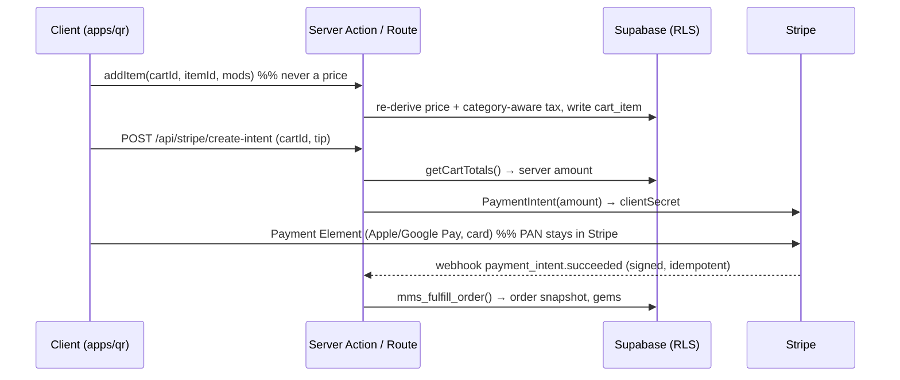

<div align="center">

# ☕ MMS Platform

### Mandalay Morning Star — dine-in QR ordering, pickup & grocery scan-and-go

[](https://github.com/min-hinthar/mms-platform/actions/workflows/ci.yml)
[](https://nextjs.org)
[](https://react.dev)
[](https://www.typescriptlang.org)
[](https://tailwindcss.com)
[](https://turbo.build)
[](https://supabase.com)
[](https://stripe.com)
[](#-license)

**Shipped:** M0 · M2–M4 · S1–S4 · R1–R9 · J0–J6 · the W-track through W22f + W23 · Option A (A1–A7b) · the polish plan's Phase 0–2 and Phase 3a–3d (part) — M1 🟡 (code done, owner-blocked infra tail) · **Next:** build the path designs PD1–PD13 ([`docs/HANDOFF.md`](docs/HANDOFF.md)) · **Gate:** 7151 qr tests + 387 ui tests · 3480 `verify:slice` mutants · **Stack:** $0/mo software (Stripe per-txn only)

</div>

---

## 📑 Table of contents

- [Overview](#-overview)
- [Architecture](#-architecture)
- [Apps & packages](#-apps--packages)
- [What it does today](#-what-it-does-today)
- [Status & roadmap](#-status--roadmap)
- [Tech stack](#-tech-stack)
- [Quick start](#-quick-start)
- [Local gates](#-local-gates)
- [Environments (Supabase & Stripe)](#-environments-supabase--stripe)
- [Deploy on Vercel](#-deploy-on-vercel)
- [CI, reviews & workflow](#-ci-reviews--workflow)
- [Security & compliance](#-security--compliance)
- [Docs index](#-docs-index)
- [License](#-license)

---

## 🌅 Overview

One Turborepo monorepo for the **QR** half of the Mandalay Morning Star ordering surface. The delivery PWA is a **separate repo** ([`min-hinthar/mandalay-morning-star-delivery-app`](https://github.com/min-hinthar/mandalay-morning-star-delivery-app)) — the two share **one Stripe account** and one design vocabulary, and each runs on **its own Supabase project** (QR owns its catalog on `fasnpdhtvqtzjlvruqcu`; delivery stays on `ukuzkhuppqwtrdkjqrkv`):

- **`apps/qr`** — the in-store app: **Dine-in / Pickup** restaurant ordering, **Grocery Scan & Go** (barcode self-checkout), and the **staff/kitchen** console. Server-authoritative cart, category-aware CA tax, multi-device group cart, Stripe Payment Element.
- **the delivery PWA** — multi-day delivery, live in **its own repo**. Deliberately **not** in this monorepo: M5 was reshaped 2026-06-24 — QR _learns from_ delivery (its hardened mobile/iOS, a11y and motion patterns — [`docs/QR_FROM_DELIVERY.md`](docs/QR_FROM_DELIVERY.md)) instead of absorbing it; co-location is reconsidered at M6.

The app began as the productionization of the **v7.2 prototype** and has outgrown it: [`docs/DESIGN-LANGUAGE.md`](docs/DESIGN-LANGUAGE.md) is the as-built authority, and v7.2 stays the source for verbatim copy on the surfaces it still covers. The look is **editorial warm paper in light + "Night" in dark** — glass frost is Night-only and scaled by one `data-fx` dial on `<html>` — always bilingual EN + Burmese on one surface, with receipt-language money surfaces and honesty rules (claims data-backed, copy promises only what the code keeps). Read DESIGN-LANGUAGE before any visual, motion or copy work.

## 🏗 Architecture

```mermaid
graph TD
  subgraph apps
    Q[apps/qr<br/>dine-in · pickup · grocery · staff]
  end
  subgraph packages
    UI[@mms/ui<br/>tokens · Sheet · primitives · motion hooks]
    DB[@mms/db<br/>Supabase clients · generated types · Zod schemas]
    CFG[@mms/config<br/>ESLint + Prettier preset]
  end
  Q --> UI
  Q --> DB
  Q --> CFG
  DB --> SUPA[(Supabase<br/>Postgres + RLS + Realtime)]
  Q --> STRIPE[[Stripe<br/>PaymentIntent + webhook]]
  Q --> RESEND[[Resend<br/>receipt + staff email]]
  Q --> PH[[PostHog<br/>funnel · flags]]
  D[delivery PWA<br/>separate repo] -. shares Stripe + design vocabulary .-> Q
```

**Order → pay (server-authoritative):**


```mermaid
sequenceDiagram
  participant C as Client (apps/qr)
  participant S as Server Action / Route
  participant DB as Supabase (RLS)
  participant ST as Stripe
  C->>S: addItem(cartId, itemId, mods)  %% never a price
  S->>DB: re-derive price + category-aware tax, write cart_item
  C->>S: POST /api/stripe/create-intent (cartId, tip)
  S->>DB: getCartTotals() → server amount
  S->>ST: PaymentIntent(amount) → clientSecret
  C->>ST: Payment Element (Apple/Google Pay, card)  %% PAN stays in Stripe
  ST-->>S: webhook payment_intent.succeeded (signed, idempotent)
  S->>DB: mms_fulfill_order() → order snapshot, gems
```

The client **never computes a price**; the server re-derives every amount from the menu row + validated modifiers. Group ordering rides **private Supabase Realtime channels authorized by RLS** off a short-lived table-session JWT. Full spec in [`docs/ARCHITECTURE.md`](docs/ARCHITECTURE.md).

## 📦 Apps & packages

| Workspace        | What                                                                                                                  | Status                                                                                                      |
| ---------------- | --------------------------------------------------------------------------------------------------------------------- | ----------------------------------------------------------------------------------------------------------- |
| `apps/qr`        | QR dine-in/pickup + grocery scan-and-go, and the staff/kitchen console                                                | ✅ live — see [What it does today](#-what-it-does-today)                                                    |
| `@mms/ui`        | tokens (light + Night, the `data-fx` dial) and the primitives, motion and gesture hooks — `packages/ui/src/index.ts`  | ✅ in use                                                                                                   |
| `@mms/db`        | Supabase clients (browser/server/service) · generated types · Zod schemas — migrations live in `supabase/migrations/` | ✅ in use                                                                                                   |
| `@mms/config`    | the shared ESLint + Prettier preset every workspace extends                                                           | ✅ in use                                                                                                   |
| _(delivery PWA)_ | its own repo — QR only **learns from** it (M5 reshaped 2026-06-24)                                                    | ↗ [`mandalay-morning-star-delivery-app`](https://github.com/min-hinthar/mandalay-morning-star-delivery-app) |

## ✨ What it does today

**Diner (dine-in · pickup)** — browse first: a toolbar-first menu (search, categories, dietary filters in a sheet behind one chip, the free-from disclaimer travelling with them) and ONE static picks row with three lenses — your favorites, **Most ordered** (POS-backed, a set never a rank) and an honest **Surprise** draw. The **Menu · Order · Account** spine follows the order (Phase 3a/3b); the Bill reads as a receipt with one hero verb per state and a server-clocked Undo after Send (3c-i); dine-in asks for the table once, inside the first Send (3c-ii). Group cart + host lock · promo codes · honest pickup slots · Morning Star Rewards · order history + "Order again" · ungated feedback. Detail: [`docs/PHASE3_JOURNEYS.md`](docs/PHASE3_JOURNEYS.md) and DESIGN-LANGUAGE §21–§27 · §30–§33.

**Staff & kitchen** — five screens (Kitchen · Counter & tables · Menu · Tips · Sign-in, A4) plus the order pad, the order-ready board (`/board`) and the glossary. Burmese / Both / English per device (2e); counter orders cook before they are paid (2f); a stuck tablet never traps staff (2h); new builds land without losing work (2i). Tips reporting shows an unattributable settle as a shared bucket, never an invented per-head split.

**Grocery Scan & Go** — phone-camera barcode scanning (native `BarcodeDetector` + `@zxing` fallback), a UPC catalog, category-aware tax (food exempt / retail taxable) and EBT-eligibility tags (SNAP checkout = 2027 via Forage). The market's next phase waits on real shelf UPCs and price confirmation (OPEN-ITEMS C6). Spec: [`docs/context/SPEC-GROCERY.md`](docs/context/SPEC-GROCERY.md) · [`docs/GROCERY_MARKET_PLAN.md`](docs/GROCERY_MARKET_PLAN.md).

**Receipts, email & live tracking** — one identity module (`apps/qr/lib/brand.ts`), one tracked-order shape and one receipt derivation feed the durable receipt, the receipt email and `/track`; every money row is the fulfillment-time snapshot rendered verbatim, and a refunded order never reads "Paid in full" (DESIGN-LANGUAGE §8 · §10).

**Platform** — server-authoritative cart + pricing · **category-aware CA tax** (one 10.5% Covina rate; CDTFA Reg 1603/80-80 decides _what_ is taxable — hot/prepared + retail always, cold food dine-in only, grocery staples exempt — TS `lib/tax.ts` and SQL `mms_line_tax` pinned in parity by tests) · Stripe Payment Element (SAQ-A) · multi-device group cart (Realtime + RLS) · PostHog funnel · CSP/security headers · WCAG 2.2 AA.

**Parked in production** (`SURFACES` in `apps/qr/lib/surfaces.ts`, Option A · A1) — self-serve split pay across phones, card-on-file tabs and the kiosk. Their code and mutants stay; no screen offers the door and the server refuses it. A dine-in guest can also ask to pay at the counter (A1), where staff settle by cash or Terminal (A3). Planned: PD2 puts phone pay on the dine-in Bill behind its own switch until live card keys (OPEN-ITEMS C2).

## 📊 Status & roadmap

Tracked in [`ROADMAP.md`](ROADMAP.md) (milestones → phases → tasks), the single open-work registry [`docs/OPEN-ITEMS.md`](docs/OPEN-ITEMS.md), and the pickup point [`docs/HANDOFF.md`](docs/HANDOFF.md). Changelog: [`CHANGELOG.md`](CHANGELOG.md).

| Milestone                         | Scope                                                                                                         | State                                      |
| --------------------------------- | ------------------------------------------------------------------------------------------------------------- | ------------------------------------------ |
| **M0** Scaffold                   | monorepo, RLS migration, tax fn, server cart, Stripe routes, Realtime hook, grocery scan, CI                  | ✅ done                                    |
| **M1** Walking pay path           | sign table-session JWT · Payment Element + cart-create · authz Server Actions · webhook reconcile · nonce CSP | 🟡 P1.0–P1.6 ✅ (owner-blocked infra left) |
| **M2** Tax + promos + scheduling  | server promos · honest pickup slots · grocery sessions · QBO sync                                             | ✅ P2.1–P2.4                               |
| **M3** Group cart                 | table session + RLS + Realtime presence + host lock (multi-device) · split-tender · abuse limits              | ✅ done                                    |
| **M4** Rewards & account          | Morning Star Rewards (QR-local, mirrors delivery's ladder) · redemption · history/reorder · ungated feedback  | ✅ P4.1–P4.3                               |
| **M5** QR learns from delivery    | repos stay separate (reshaped 2026-06-24) — adopt delivery's mobile/a11y/motion patterns + shared primitives  | 🟡                                         |
| **M6** Kiosk + EBT (2027)         | kiosk shell · Forage EBT — Stripe Terminal was pulled forward and shipped as W6c                              | ⏸                                          |
| **Tracks** S · R · J · W          | S1–S4 service model · R1–R9 richness · J0–J6 journey · W5–W23 polish arcs (W22d's light half open, M86)       | ✅ through W22f + W23                      |
| **Option A** subtract to the core | park split pay · card-on-file tabs · kiosk; settlement = cash + Terminal; `/staff` to five screens            | ✅ A1–A7b                                  |
| **Polish plan** Phase 0 → 4       | design system in code · the guest flow · staff · the journeys · production signals                            | 🟡 0–2 ✅ · 3a–3d (part) ✅ · 3e/3f/4 ⬜   |
| **Path designs** PD1–PD13         | the owner's picks, 2026-10-07 — [`docs/PATH_DESIGN_2026-10-07.md`](docs/PATH_DESIGN_2026-10-07.md)            | ⬜ next                                    |

**Done** means the definition in [`docs/WORKFLOW.md`](docs/WORKFLOW.md) §Definition of done (with CLAUDE.md's "Gate before done"). Start any session with [`docs/HANDOFF.md`](docs/HANDOFF.md), then [`docs/context/INDEX.md`](docs/context/INDEX.md).

## 🧰 Tech stack

Next.js 16 (App Router, RSC, Server Actions) · React 19 · TypeScript strict · Tailwind v4 · Turborepo + pnpm · Supabase (Postgres · RLS · Realtime · Auth) · Stripe (Payment Element + webhooks) · Resend + React Email · framer-motion · `next-view-transitions` · Zustand · Serwist (PWA) · PostHog (free tier) · Radix UI · `@number-flow/react` (re-exported from `@mms/ui`) · `@zxing/library` · Vitest. The **$0/month free stack** is documented in [`docs/context/FREE-KIT-MAP.md`](docs/context/FREE-KIT-MAP.md).

## 🚀 Quick start

```bash
corepack enable && corepack prepare pnpm@11.7.0 --activate   # Node >= 22.13 (pnpm 11's floor; CI runs 24)
pnpm install
supabase start                    # a LOCAL stack (Docker): applies every migration + supabase/seed.sql, as CI does
cp .env.example apps/qr/.env.local   # point the Supabase vars at the URL/keys `supabase start` printed; Stripe test keys
pnpm dev                          # apps/qr on http://localhost:3000
```

⚠️ **Never `supabase db push` or SQL-editor DDL against the QR project.** Prod's migration history is divergent from this repo (OPEN-ITEMS M125), and preview shares that one project. A prod migration is applied ONE file at a time with the Supabase MCP `apply_migration`, on the owner's go, verifying the objects that file creates before the next — see CLAUDE.md § Commands.

## ✅ Local gates

```bash
pnpm turbo lint typecheck build test          # CI's build job
pnpm check:docs                               # GFM table parity + live-state counts measured, never transcribed
pnpm verify:slice --no-gate --only=<module>   # each money/authority module you touched — the pre-push step
pnpm verify:slice --list --only=<module>      # what a filter selects, without running anything
```

**The full mutation battery runs in CI** as the `verify-slice` check: 12 cost-balanced shards on every non-draft PR head and every push to `main`, code lane only — about 10.5–11 min wall after the `changes` job, measured 2026-10-08. A full serial local run measured 164–180 min, so it is not the pre-PR step. Only CAUGHT passes: a SURVIVING mutant means the fixture is degenerate, not that the mutant is wrong — find inputs that separate the two code paths; a STALE mutant is a failure too, not a skip; a TIMEOUT or ERROR is never a kill. Never re-run a red `verify-slice` hoping for green: a mutant that SURVIVES on one run and is CAUGHT on another of the same tree is a suite defect — fix the read, red-first (LEARNINGS #248).

⚠️ `verify:slice` rewrites the 286 money/authority modules it mutates IN PLACE (195 under `apps/qr/lib`) and restores them. It aborts on a dirty target; run ONE per checkout and **never commit while a run is live** (LEARNINGS #74). After a stalled or killed run: kill all runs; `git status --short` names the module left mutated — restore it with `git checkout -- <file>` and confirm clean. Check for a live run with `ps -eo pid,comm,args | awk '$2=="node" && /verify-slice\.mjs/'` (not `pgrep -f` — LEARNINGS #92), and list the target files with `grep -oE '^\s+file: "[^"]+"' scripts/verify-slice.mjs | sort -u` — that command, not a prose list, is the record of what a killed run may leave broken.

## 🔐 Environments (Supabase & Stripe)

**QR runs on its own Supabase project** (`fasnpdhtvqtzjlvruqcu`) and **shares the Stripe account** with the delivery app. Manage keys **per environment** ([`docs/ENV.md`](docs/ENV.md) is the wiring map):

|                                | Supabase                                                                                                                              | Stripe                                                                                                                                                                                  |
| ------------------------------ | ------------------------------------------------------------------------------------------------------------------------------------- | --------------------------------------------------------------------------------------------------------------------------------------------------------------------------------------- |
| **Production** (Vercel `main`) | the QR project · service-role + `SUPABASE_JWT_SECRET` (server-only)                                                                   | **test** keys today (C2, measured 2026-09-07: `livemode: false`); **live** `sk_live_…` only at C2's cutover (ruling #8) · the QR app's **own** webhook endpoint → its **own** `whsec_…` |
| **Preview** (PRs)              | the **same** QR project — one project for dev + preview + prod; staging is deferred (T3)                                              | **test** keys `sk_test_…` · test webhook secret                                                                                                                                         |
| **Local**                      | a `supabase start` stack: fill `.env.example`'s placeholders with the URL/keys it prints (never the QR project's — that is prod data) | **test** keys · `stripe listen` prints a temporary webhook secret                                                                                                                       |

Two rules:

1. **Never DDL production directly** — no `supabase db push`, no SQL-editor DDL. Apply ONE migration file at a time with the Supabase MCP `apply_migration` on the owner's go, verify the objects it creates, then the next; reconciling the two histories is M125. Migrations live in `supabase/migrations/`.
2. **QR owns its catalog.** The QR project holds its own `menu_categories`/`menu_items`/`modifier_*`/`grocery_items` (with `tax_category` as a column), seeded from `supabase/seed.sql`. Loyalty / account-link with the delivery side is an M4 concern, not a shared-DB dependency.

Set values in **Vercel → Project → Settings → Environment Variables** (scoped Production/Preview/Development) and never commit them (`.gitignore` excludes `.env*`). Full list in [`.env.example`](.env.example).

## ▲ Deploy on Vercel

One Vercel project, **Root Directory = `apps/qr`** — the only app in this repo (the delivery PWA deploys from its own). [`apps/qr/vercel.json`](apps/qr/vercel.json)'s `turbo-ignore` skips a build when the app didn't change, and its `regions` pin the functions to `pdx1` (C27). Push to `main` = production; every PR = a preview URL.

## 🤖 CI, reviews & workflow

| Workflow                                                                 | Trigger   | Does                                                                                                                                              |
| ------------------------------------------------------------------------ | --------- | ------------------------------------------------------------------------------------------------------------------------------------------------- |
| [`ci.yml`](.github/workflows/ci.yml)                                     | PR / push | a `changes` job picks the lanes (diagram below); a push to `main` runs every lane                                                                 |
| [`require-docs-update.yml`](.github/workflows/require-docs-update.yml)   | PR        | `require-docs` — a PR touching `apps/**` or `packages/**` must also touch `docs/**`, `CHANGELOG.md`, `ROADMAP.md` or `README.md` (or `skip-docs`) |
| [`ensure-preview.yml`](.github/workflows/ensure-preview.yml)             | PR        | safety net — force a Vercel preview if the GitHub→Vercel webhook drops the commit                                                                 |
| [`require-codex-review.yml`](.github/workflows/require-codex-review.yml) | PR        | `codex-review` — RED until Codex has reviewed the PR's **current head**; drafts stand down                                                        |

```text
changes ─┬─ docs                              docs-only PR: check:docs + format:check
         ├─ build                             code lane: the fast lane + lint/typecheck/build/test
         ├─ migrations-check + types-fresh    sql lane: migrations, types-fresh, SQL tests, race harnesses
         └─ verify-slice shard ×12 ─ verify-slice    code lane, non-draft heads + main pushes
```

Read the fast lane's steps in `ci.yml` itself; never count them in prose. A draft's `verify-slice` is RED on purpose ("not run — DRAFT"); a docs-only PR's is green ("not run — docs-only lane").

**Required checks to wire** (OPEN-ITEMS C28): `codex-review`, `verify-slice`, `build`, `migrations-check + types-fresh`, `docs`, `require-docs` — never a `verify-slice shard` leg, `publish-codex-verdict`, the retired `codex-reviewed`, `Supabase Preview` or `Vercel Preview Comments`. Keep admin bypass available and do not require Code Owner review (the sole code owner authors every PR and cannot approve their own). **None is enforced yet:** measured 2026-10-08 with an admin-scoped token, `/branches/main/protection` answers 404 and no ruleset exists, so every check is advisory until a re-measure shows the rule (C16 · C28).

**The review is in-session, not in CI.** ONE capped blind adversarial pass per PR over the full PR diff (`pnpm review:bundle` → the [`adversarial-auditor`](.claude/agents/adversarial-auditor.md) agent; ≤3 lenses, ≤10 agents, ~15 min) runs in parallel with the `verify-slice` check, its verdict posted as a PR comment. Codex reviews too: `@codex review` on the draft, two triaged rounds, fix-or-justify, round 3+ to OPEN-ITEMS. **Merge** only a head whose `codex-review` says "Codex has reviewed" it (unless Codex's usage-limit reply is on that head: then WORKFLOW step 5 (g)) AND whose `verify-slice` is green — mark-ready and merge are never one motion, and a pushed fix is a new head that waits again. `codex-review` proves a review EXISTS on the head, never that anyone read it; and until the checks are required, only that ritual enforces the wait — #241 was merged eleven seconds after it went red. Normative copy: [`docs/WORKFLOW.md`](docs/WORKFLOW.md) §Review, step 5.

**Codex out of quota (owner, 2026-10-08).** When Codex answers with its usage-limit message, the capped blind review of the EXACT head stands in: its verdict is posted on the PR naming that SHA, with `verify-slice` and the rest of CI green on it, and the OWNER merges that head with GitHub's admin bypass, by hand. An agent never merges a head whose `codex-review` is red (the `.md`-only waiver, under the conditions in WORKFLOW §Review step 5 (f), is the one exception) — even though its admin-scoped token could — and never automates the bypass. The bypass covers a red `codex-review` only (WORKFLOW §Review step 5 (g), which also holds the owner's ruling for a fix pushed after the capped pass: one more capped pass over those fix commits — "Yes one more", 2026-10-08).

**Quality:** ESLint + Prettier + knip via the shared `@mms/config` preset (`pnpm lint` / `pnpm format` / `pnpm knip`). **Claude Code** is configured by [`CLAUDE.md`](CLAUDE.md) + [`.claude/`](.claude) — settings, a post-edit auto-format hook, session-memory hooks, `LEARNINGS` / `ERROR_HISTORY`, the `adversarial-auditor` agent and the [`design-prototyping`](.claude/skills/design-prototyping/SKILL.md) skill (the standard design-thinking loop). ⚠️ [`.mcp.json`](.mcp.json)'s Supabase entry points at the QR project (`fasnpdhtvqtzjlvruqcu`; the owner, 2026-10-08) and its GitHub/Sentry entries use the Windows-only `npx.cmd` — a session can load another MCP config, so confirm the target project (e.g. `get_project_url`) before any MCP write. Contributing + templates: [`.github/`](.github).

## 🛡 Security & compliance

Server-authoritative pricing (no client-trusted amounts) · Supabase **RLS** on every table + private Realtime · Stripe **PCI SAQ-A** (PAN only in Stripe's iframe) · server-validated promos · CSP/security headers · **SB-1524** disclosure wherever a fee row shows (the service charge itself was retired in W16a) · **never** surcharge debit · **EBT/SNAP deferred to 2027** (Forage + FNS, 50%-rule). The acceptance gate: [`docs/context/QA-CHECKLIST.md`](docs/context/QA-CHECKLIST.md) — tick the items a change touches in its PR body.

## 📚 Docs index

**Start here:** [`docs/HANDOFF.md`](docs/HANDOFF.md) (the pickup point) · [`docs/OPEN-ITEMS.md`](docs/OPEN-ITEMS.md) (the single open-work registry) · [`docs/WORKFLOW.md`](docs/WORKFLOW.md) (the loop and the merge ritual) · [`docs/OWNER_RULINGS_2026-10-07.md`](docs/OWNER_RULINGS_2026-10-07.md) (the owner's binding rulings) · [`docs/context/INDEX.md`](docs/context/INDEX.md) (decisions · rubric · QA gate · red-team · v7.2 prototype)

**Every docs file, one line each, grouped:** [`docs/README.md`](docs/README.md). **History:** [`ROADMAP.md`](ROADMAP.md) · [`CHANGELOG.md`](CHANGELOG.md)

## 📄 License

Proprietary © Mandalay Morning Star LLC. The repo is public for free CI/Actions and transparency; the code is not licensed for reuse.
