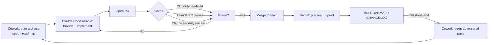

# 🔄 Workflow

How this repo is built and reviewed — tuned for a solo maintainer working from **Cowork** (planning, docs, specs, adversarial reviews) and **Claude Code remote** (implementation), with **GitHub Actions** doing automated review + CI and **Vercel** doing deploys. Same rhythm as the delivery app.

## The loop

## Roles
- **Cowork** — break a milestone into phases, write/refresh specs (`docs/`), update `ROADMAP.md`, and run **deep adversarial reviews** (parallel specialist passes, like the v7.1 red-team) at each milestone exit.
- **Claude Code (remote)** — do the implementation on a branch, open the PR, respond to review comments.
- **GitHub Actions** — automated **Claude PR review** + **security review** on every PR, plus **CI** (turbo lint/typecheck/build) and a **weekly scheduled adversarial pass**.
- **Vercel** — preview per PR, production on `main`.

## Branches & PRs
- `main` is protected (require CI + 1 review). Work on phase branches: `m<milestone>/p<phase>-<slug>` — e.g. `m1/p1-session-mint`.
- **One phase = one PR** (small, reviewable). PR title: `M1·P1 session mint` + a body that links the ROADMAP phase and checks the QA-checklist items it touches (the PR template prompts this).
- Conventional commits (`feat:`, `fix:`, `chore:`, `docs:`); CHANGELOG entry on merge.

## Reviews (three layers)
1. **Per-PR automated** — `claude-review.yml` posts inline comments + a security review. Must be addressed before merge.
2. **Weekly scheduled** — `adversarial.yml` runs a deeper pass over the whole codebase vs `docs/REVIEW.md` + the QA checklist and opens an issue with findings.
3. **Per-milestone deep adversarial** — run from Cowork at each milestone exit (a11y / perf / security / product specialists in parallel), graded against the world-class rubric. No milestone is "done" until it clears its QA-checklist gate.

## Tracking
`ROADMAP.md` is the source of truth (milestones → phases → tasks). It mirrors to the **GitHub Project** board via labels: `milestone:M0…M6`, `phase`, `type:feat|fix|chore|docs|security`, `prio:P0…P3`. Create them once with `setup.sh` (or `gh label create …` / `gh project create`). Closing a phase = check the box in `ROADMAP.md` + move the card + a CHANGELOG line.

## Secrets & tokens
- **Reviews** use a Claude Code OAuth token on the Max-plan quota (no per-token API billing): run `claude setup-token`, then `gh secret set CLAUDE_CODE_OAUTH_TOKEN`.
- **App env** lives only in Vercel (scoped Production/Preview/Development) — never in git. See the README → Environments.

## Definition of done (per phase)
CI green · Claude review + security review addressed · QA-checklist items for the phase ticked · `ROADMAP.md` box checked · `CHANGELOG.md` updated · preview deploy smoke-tested.
