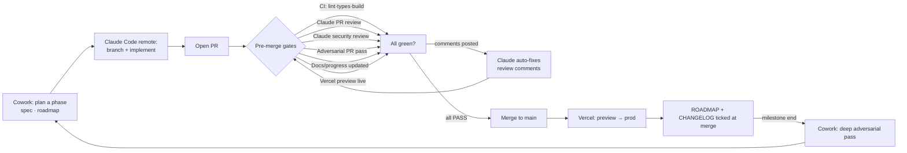

# 🔄 Workflow

How this repo is built and reviewed — tuned for a solo maintainer working from **Cowork** (planning, docs, specs, adversarial reviews) and **Claude Code remote** (implementation), with **GitHub Actions** doing automated review + CI and **Vercel** doing deploys. Same rhythm as the delivery app.

## The loop

## Roles

- **Cowork** — break a milestone into phases, write/refresh specs (`docs/`), update `ROADMAP.md`, and run **deep adversarial reviews** at each milestone exit.
- **Claude Code (remote)** — do the implementation on a branch, open the PR, fix review comments via the auto-fix workflow.
- **GitHub Actions** — **CI + docs gate + preview check** on every push; **Claude PR review + security** on PR open / `ready_for_review` (or the on-demand `review` label); the **adversarial PR pass** as a pre-merge gate (the `adversarial` label); plus a **weekly scheduled adversarial pass** over the whole repo. The token-metered Claude passes are deliberately not per-push (quota + signal-to-noise).
- **Vercel** — preview per PR, production on `main`.

## Branches & PRs

- `main` is protected: every pre-merge gate (see below) must be PASS before merge. Force-push blocked; conversation resolution required. Make the gates **required status checks** (Settings → Branches → `main`): `ci`, `claude-review` / `security`, `adversarial-pr`, `require-docs-update`. Until a check is marked required, a red run won't actually block the merge button.
- **Branch naming — `claude/<type>/<slug>`.** `<type>` is the conventional-commit type (`feat`/`fix`/`docs`/`chore`/`refactor`/`ci`); `<slug>` is kebab-case and carries the milestone/phase context. e.g. `claude/feat/m1-p1-session-mint`, `claude/fix/webhook-idempotency`, `claude/docs/research-context`. The `claude/` prefix marks Claude-authored work and matches the GitHub action's default `branch_prefix`, so remote sessions, the action, and you all converge on one professional scheme.
- **One phase = one PR** (small, reviewable). PR title is a conventional-commit summary with milestone context: `feat(qr): M1·P1 session mint` + a body that links the ROADMAP phase and ticks the QA-checklist items it touches (the PR template prompts this).
- Conventional commits (`feat:`, `fix:`, `chore:`, `docs:`); CHANGELOG entry on merge.

## Pre-merge gates

**Token-metered passes (Claude review / security / adversarial) do NOT run on every push** — that
burned Max-plan quota and re-surfaced the same findings round after round. The cheap checks (CI, docs,
preview) run on every push; the Claude passes are on-demand / pre-merge:

1. **CI** — `ci.yml`: `pnpm turbo run lint typecheck build` across all workspaces (+ `migrations-check` / `types-fresh`). Node 24, frozen lockfile. **Every push.**
2. **Claude PR review** — `claude-review.yml` → `review` job. Runs on **`opened` / `ready_for_review`** (the first look) or when you add the **`review` label** (re-review after addressing comments). A plain push is a **no-op success**, so the required check stays green on the new head SHA without re-reviewing the whole diff. Inline comments against `docs/REVIEW.md`'s QA checklist (server-authoritative pricing, RLS, Stripe idempotency/PCI, a11y).
3. **Claude security review** — `claude-review.yml` → `security` job. Same on-demand trigger as #2 (`opened`/`ready_for_review`/`review` label; no-op on plain push), through `anthropics/claude-code-action@v1` on the OAuth/Max-plan token, attacking the money + auth paths.
4. **Adversarial PR pass** — `adversarial-pr.yml`. **PRE-MERGE gate, label-only:** it runs solely when you add the **`adversarial` label** (when the PR is ready to merge) — not on push. As a required check it stays **"expected" (merge blocked) until you label it and it reports `ADVERSARIAL_VERDICT: PASS`**. Diff-scoped red-team across a11y / perf / security / product/UX; posts a severity-ranked findings table. **Fail-closed**: passes only on an explicit `PASS` (a skipped/errored pass = no verdict = fail). Clear a no-verdict failure by re-running, or — after a manual review — with the **`adversarial-signed-off`** label.
5. **Docs / progress updated** — `require-docs-update.yml`. If a PR changes `apps/**` or `packages/**`, it must also touch `docs/**`, `CHANGELOG.md`, `ROADMAP.md`, or `README.md`. Opt-out by labeling the PR `skip-docs` (use sparingly). **Every push.**
6. **Vercel preview** — `ensure-preview.yml`. Forces a preview build via the Vercel API if the GitHub→Vercel webhook drops. Smoke-test the preview before approving. **Every push.**

> **Merge ritual:** open PR → CI + the on-open Claude review run → address comments (push fixes; CI re-runs, the Claude passes don't) → re-review on demand with the **`review`** label if you want → when green and ready, add the **`adversarial`** label → it runs and must report PASS → merge. Branch-protection required checks are unchanged (`ci`, `claude-review`/`security`, `adversarial-pr`, `require-docs-update`); review/security report green on every push via the no-op, and `adversarial-pr` is the one that holds the merge until you label.

## Auto-fix review comments

When the per-PR review (Claude or human) posts comments, `claude-fix-pr-comments.yml` runs automatically:

- Triggers on `pull_request_review.submitted`, `pull_request_review_comment.created`, or a `/claude-fix` comment in the PR.
- Fetches every unresolved comment via `gh api`, edits the cited file:line, runs `pnpm turbo run lint typecheck build`, commits one conventional commit per logical group, and pushes to the PR branch.
- Re-runs gates (#1–#6) on the new commit. Loop until green.
- Posts a summary comment listing what it addressed and what it intentionally skipped (with a reason).
- Never force-pushes. Never modifies workflow secrets or branch protection.

To manually retrigger: comment `/claude-fix` on the PR.

> ⚠️ **Workflow-edit caveat (anti-tampering).** `claude-code-action@v1` refuses to run on a PR unless the triggering workflow file is **byte-identical to the copy on `main`**. So a PR that edits `.github/workflows/claude-review.yml` or `adversarial-pr.yml` gets **no auto review or adversarial pass of itself** — those jobs exit in ~2 s posting nothing, yet report "success." Don't read the fast green as a clean review. Such PRs need a **manual adversarial sign-off**: run the adversarial pass yourself (or in Cowork), then add the **`adversarial-signed-off`** label to satisfy the fail-closed gate. The automated loop resumes on the next PR after the workflow change lands on `main`.

## Weekly + per-milestone adversarial

- **Weekly** (`adversarial.yml`) — Mondays 16:00 UTC. Deep whole-repo pass that opens an issue with a severity-ranked findings table and the top 5 fixes. Labeled `adversarial`, `type:security`.
- **Per-milestone** — run from Cowork at each milestone exit (a11y / perf / security / product specialists in parallel), graded against the world-class rubric. No milestone is "done" until it clears its QA-checklist gate.

## Tracking

`ROADMAP.md` is the source of truth (milestones → phases → tasks). It mirrors to the **GitHub Project** board via labels: `milestone:M0…M6`, `phase`, `type:feat|fix|chore|docs|security`, `prio:P0…P3`. Closing a phase = check the box in `ROADMAP.md` + move the card + a CHANGELOG line (enforced by gate #5).

## Secrets & tokens

- **All Claude workflows** use a Claude Code OAuth token on the Max-plan quota (no per-token API billing): run `claude setup-token`, then `gh secret set CLAUDE_CODE_OAUTH_TOKEN`.
- **Vercel preview safety net** — `VERCEL_TOKEN` secret + `VERCEL_PROJECT_ID` / `VERCEL_TEAM_ID` / `VERCEL_REPO_ID` / `VERCEL_PROJECT_NAME` repo vars (optional; `ensure-preview.yml` no-ops without them).
- **App env** lives only in Vercel (scoped Production/Preview/Development) — never in git. See the README → Environments.

## Definition of done (per phase)

All 6 pre-merge gates green · Claude auto-fix has addressed all review comments (or noted why not) · QA-checklist items for the phase ticked · `ROADMAP.md` box checked · `CHANGELOG.md` updated · preview deploy smoke-tested · merged to `main` · production deploy verified.
