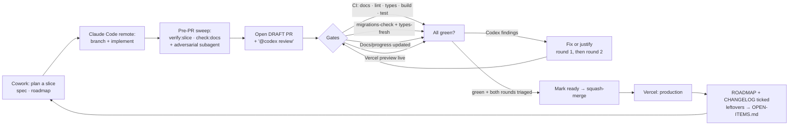

# 🔄 Workflow

How this repo is built and reviewed — tuned for a solo maintainer working from **Cowork** (planning, docs, specs) and **Claude Code remote** (implementation), with **GitHub Actions** doing the mechanical CI and **Vercel** doing deploys.

> **Read this first if you remember the old loop.** Review used to run as metered GitHub Actions —
> `claude-review.yml` (a `review` + `security` job), `adversarial-pr.yml` behind an `adversarial`
> label, `claude-fix-pr-comments.yml`, and a weekly `adversarial.yml`. **All of them are gone**, and
> so are the always-green `review`/`security`/`adversarial-pr` stub checks that briefly stood in for
> them in branch protection. `ls .github/workflows` is the whole truth: **`ci.yml`**,
> **`require-docs-update.yml`**, **`ensure-preview.yml`**. Review is now **in-session** — a
> fresh-context adversarial subagent plus two Codex rounds — because doing it reactively in CI burned
> Max-plan quota re-surfacing the same findings round after round (M1·P1.5 spent 6 metered rounds and
> a disable/fix/re-label dance; `.claude/LEARNINGS.md` #44/#47).

## The loop

## Roles

- **Cowork** — break a milestone into slices, write/refresh specs (`docs/`), update `ROADMAP.md`.
- **Claude Code (remote)** — implement on a branch, run the pre-PR sweep, open the PR, triage the reviews, merge.
- **GitHub Actions** — **mechanical only**: CI (docs gate · lint · typecheck · build · test · migrations · types-fresh · SQL tests), the docs/progress gate, and the Vercel-preview safety net. **No token-metered Claude pass runs in CI.**
- **The reviewers** — an **in-session fresh-context adversarial subagent** (the Agent tool) and **Codex** (the GitHub app). Neither is a workflow; see _Review_ below.
- **Vercel** — preview per PR, production on `main`.

## Branches & PRs

- `main` is protected: CI must be green before merge. Force-push blocked. Required status checks are the ones that actually exist — `build`, `migrations-check + types-fresh`, `require-docs`. Until a check is marked required, a red run won't block the merge button.
- **Branch naming — `claude/<type>/<slug>`.** `<type>` is the conventional-commit type (`feat`/`fix`/`docs`/`chore`/`refactor`/`ci`); `<slug>` is kebab-case and carries the milestone/phase context. e.g. `claude/feat/m1-p1-session-mint`, `claude/fix/webhook-idempotency`, `claude/docs/research-context`.
- **One slice = one PR** (small, reviewable). Open it as a **draft**: Codex fires when a PR leaves draft or on an explicit `@codex review`, and marking-ready-and-squashing in one breath is how a whole round of its findings once landed minutes _after_ the merge, unread (W20/#191 — 2×P1 + 2×P2, all four real).
- PR title is a conventional-commit summary with milestone context: `feat(qr): M1·P1 session mint`; the body links the ROADMAP phase and ticks the QA-checklist items it touches.
- Conventional commits (`feat:`, `fix:`, `chore:`, `docs:`); CHANGELOG entry on merge.

## Gates that run in CI (every push, zero tokens)

1. **CI** — `ci.yml`, two jobs. **`build`**: `pnpm check:docs` (GFM table parity + live-state counts re-measured, never transcribed) → the orphan-suite guard → `pnpm turbo run lint typecheck build test`. **`migrations-check + types-fresh`**: boots the local Supabase stack, applies every migration + seed, proves `packages/db/src/database.types.ts` isn't stale, and runs every load-bearing `supabase/tests/*.sql` (each named explicitly — add yours to that list, or it passes by not existing).
2. **Docs / progress updated** — `require-docs-update.yml`. A PR touching `apps/**` or `packages/**` must also touch `docs/**`, `CHANGELOG.md`, `ROADMAP.md`, or `README.md`. Opt out with the `skip-docs` label (sparingly).
3. **Vercel preview** — `ensure-preview.yml`. Forces a preview via the Vercel API if the GitHub→Vercel webhook drops the commit (it does, intermittently, for commits pushed from a cloud session). Smoke-test the preview before merging.

## Review — in-session, plus Codex

**Do the review before the gate does.** The recurring waste across M1 was shipping a correct-but-incomplete first commit and letting a reviewer tease out the craft round by round (P1.2 took 5 passes). Run the **Pre-PR self-review sweep** in `CLAUDE.md` on your own diff first — money/auth/RLS, a11y, error/recovery paths, copy fidelity — then:

1. **`pnpm verify:slice` FIRST** — the mechanical gate. Runs the full gate, applies 124 semantic mutations to the money/authority modules (each **must** turn its owning suite red), and mirrors CI's orphan check. ~1 minute, zero tokens. A **surviving** mutant means the fixture is degenerate; a **stale** one is a failure, not a skip.
2. **`pnpm check:docs`** — table parity + measured counts.
3. **ONE fresh-context adversarial subagent** over the diff — **HARD CAP** (owner directive, 2026-08-05): delta-scoped, **≤3 lenses**, **≤10 agents**, **~15 min**. If it stalls or overruns, kill it and hand-triage its partial output — never relaunch. After applying fixes: mechanical gates + a hand-read of the fix diff, **never another agent round**. Post its verdict as a PR comment for the record.
4. **Two Codex rounds, then merge** (owner, 2026-08-16). Comment `@codex review` on the draft immediately after opening; round 2 on the fix commits. Fix-or-justify every finding in both. From round 3 on, fix-on-sight trivia may still land in one small commit, but anything else — polish, edge-case copy, shrinking-materiality nits — goes to `docs/OPEN-ITEMS.md` and **the PR merges**. The loop converges; it never terminates on its own (W22a/#194 ran 4 rounds: 4 → 5 → 1 → 2 findings, each real but each smaller).

Codex is a second independent reviewer, not a substitute for the in-session pass. Triaging its findings is a hand-read — it does **not** spend another agent round.

## Tracking

`ROADMAP.md` is the source of truth (milestones → phases → tasks). Closing a slice = check the box in `ROADMAP.md` + a `CHANGELOG.md` line + sweep [`docs/OPEN-ITEMS.md`](OPEN-ITEMS.md) (the single registry — close, retire, or add the items your change touched).

## Secrets & tokens

- **App env** lives only in Vercel (scoped Production/Preview/Development) and GitHub Actions secrets — **never in git** (`.gitignore` covers `.env*`). See the README → Environments.
- **Vercel preview safety net** — `VERCEL_TOKEN` secret + `VERCEL_PROJECT_ID` / `VERCEL_TEAM_ID` / `VERCEL_REPO_ID` / `VERCEL_PROJECT_NAME` repo vars (optional; `ensure-preview.yml` no-ops without them).
- No Claude API token is needed by CI any more — nothing metered runs there.

## Definition of done (per slice)

`pnpm verify:slice` green · `pnpm check:docs` green · CI green · the adversarial verdict posted and its findings fixed · **both Codex rounds** fixed-or-justified · QA-checklist items the change touches ticked (`docs/context/QA-CHECKLIST.md`, tracked in `docs/REVIEW.md`) · `ROADMAP.md` box checked · `CHANGELOG.md` line added · `docs/OPEN-ITEMS.md` swept · preview smoke-tested · merged to `main` · production deploy verified. Learned something non-obvious? Append it to `.claude/LEARNINGS.md`.
