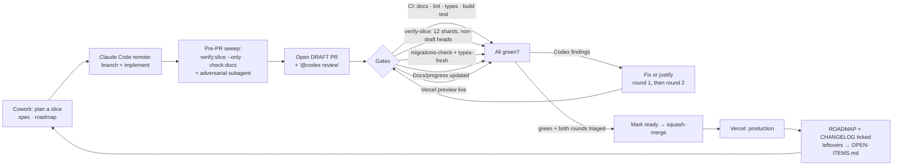

# 🔄 Workflow

How this repo is built and reviewed — tuned for a solo maintainer working from **Cowork** (planning, docs, specs) and **Claude Code remote** (implementation), with **GitHub Actions** doing the mechanical CI and **Vercel** doing deploys.

> **Read this first if you remember the old loop.** Review used to run as metered GitHub Actions —
> `claude-review.yml` (a `review` + `security` job), `adversarial-pr.yml` behind an `adversarial`
> label, `claude-fix-pr-comments.yml`, and a weekly `adversarial.yml`. **All of them are gone**, and
> so are the always-green `review`/`security`/`adversarial-pr` stub checks that briefly stood in for
> them in branch protection. `ls .github/workflows` is the whole truth (measure it — this line once
> left out **`require-codex-review.yml`**, the Codex wait). Review is now **in-session** — a
> fresh-context adversarial subagent plus two Codex rounds — because doing it reactively in CI burned
> Max-plan quota re-surfacing the same findings round after round (M1·P1.5 spent 6 metered rounds and
> a disable/fix/re-label dance; `.claude/LEARNINGS.md` #44/#47).

## The loop

```mermaid
flowchart LR
  A[Cowork: plan a slice<br/>spec · roadmap] --> B[Claude Code remote:<br/>branch + implement]
  B --> S[Pre-PR sweep:<br/>verify:slice --only · check:docs<br/>+ adversarial subagent]
  S --> C[Open DRAFT PR<br/>+ '@codex review']
  C --> D{Gates}
  D -->|CI: docs · lint · types · build · test| E
  D -->|verify-slice: 12 shards, non-draft heads| E
  D -->|migrations-check + types-fresh| E
  D -->|Docs/progress updated| E
  D -->|Vercel preview live| E[All green?]
  E -->|Codex findings| F[Fix or justify<br/>round 1, then round 2]
  F --> D
  E -->|green + both rounds triaged| G[Mark ready → squash-merge]
  G --> H[Vercel: production]
  H --> I[ROADMAP + CHANGELOG ticked<br/>leftovers → OPEN-ITEMS.md]
    I --> A
```

## Design-thinking prototyping (the standard, owner 2026-10-08)

When the owner asks for design thinking, prototypes or an elevated path, run the loop in
[`.claude/skills/design-prototyping/SKILL.md`](../.claude/skills/design-prototyping/SKILL.md): map the
paths, diverge three directions per moment on the owner's design canvas, ask the owner once, refine with
one consistency pass and an adversarial critic, record it in a docs-only PR (a record, one spec per
moment, OPEN-ITEMS rows naming the stream that builds each), then the blind pass and Codex as above, and
merge on the owner's go. The worked example is `docs/PATH_DESIGN_2026-10-07.md` (#319). Streams then
build from the record; it wins over a stream card for the moments it covers.

## Roles

- **Cowork** — break a milestone into slices, write/refresh specs (`docs/`), update `ROADMAP.md`.
- **Claude Code (remote)** — implement on a branch, run the pre-PR sweep, open the PR, triage the reviews, merge.
- **GitHub Actions** — **mechanical only**: CI (docs gate · lint · typecheck · build · test · migrations · types-fresh · SQL tests · the `verify-slice` mutation battery), the docs/progress gate, the Codex wait (`codex-review`), and the Vercel-preview safety net. **No token-metered Claude pass runs in CI.**
- **The reviewers** — an **in-session fresh-context adversarial subagent** (the Agent tool) and **Codex** (the GitHub app). Neither is a workflow; see _Review_ below.
- **Vercel** — preview per PR, production on `main`.

## Branches & PRs

- `main` is meant to be protected: CI green before merge, force-push blocked. **Measured 2026-10-08, it is NOT:** the repo had drifted private on the Free plan, where `/branches/main/protection` and `/rulesets` answered 403. The owner made it **public again** that day (free Actions minutes; re-measured `private: false`), and protection now answers 404 — available, but no rule exists, so every check is still advisory and a red run blocks nothing until the owner requires `codex-review`, `verify-slice`, `build`, `migrations-check + types-fresh`, `docs` and `require-docs` (OPEN-ITEMS C28, folding in C16). A lane job skipped by its `if` reports success, so a docs-only PR is never stuck pending on `build` or `verify-slice`.
- **Branch naming — `claude/<type>/<slug>`.** `<type>` is the conventional-commit type (`feat`/`fix`/`docs`/`chore`/`refactor`/`ci`); `<slug>` is kebab-case and carries the milestone/phase context. e.g. `claude/feat/m1-p1-session-mint`, `claude/fix/webhook-idempotency`, `claude/docs/research-context`.
- **One slice = one PR** (small, reviewable). Open it as a **draft**: Codex fires when a PR leaves draft or on an explicit `@codex review`, and marking-ready-and-squashing in one breath is how a whole round of its findings once landed minutes _after_ the merge, unread (W20/#191 — 2×P1 + 2×P2, all four real).
- PR title is a conventional-commit summary with milestone context: `feat(qr): M1·P1 session mint`; the body links the ROADMAP phase and ticks the QA-checklist items it touches.
- Conventional commits (`feat:`, `fix:`, `chore:`, `docs:`); CHANGELOG entry on merge.

## Gates that run in CI (zero tokens)

1. **CI** — `ci.yml`, split into **lanes** (2026-10-08) by a `changes` job that every other job reads through a job-level `if` (never a workflow `paths:` filter, which would leave a required check pending forever). Pushes to `main` and manual runs are unfiltered: every lane runs.
   - **`docs`** — a PR whose every changed path is `*.md` (any depth) or under `.claude/`: `pnpm check:docs` + `pnpm format:check`, nothing else. Not `docs/**`: a test reads `docs/prototype/v7.2.html` and the menu reference reads `docs/data/*.json`.
   - **`build`** — every other PR: the fast lane (`pnpm check:docs` — GFM table parity + live-state counts re-measured, never transcribed — then the file-read guards, each with `if: !cancelled()` so one red guard no longer hides the rest), the orphan-suite and test-environment guards, then `pnpm turbo run lint typecheck build test` and the build-stamp check.
   - **`migrations-check + types-fresh`** — only when a path it reads changed (`supabase/**`, the generated types, the race and authority harnesses, a workflow): boots the local Supabase stack, applies every migration + seed, proves `packages/db/src/database.types.ts` isn't stale, and runs every load-bearing `supabase/tests/*.sql` (each named explicitly — add yours to that list, or it passes by not existing).
   - **`verify-slice`** — the money/authority mutation battery, code lane only, on non-draft PR heads (`ready_for_review` starts it) and pushes to `main`: twelve `verify-slice shard` jobs each run `node scripts/verify-slice.mjs --no-gate --shard=i/12` in their own checkout, and the aggregate `verify-slice` job is the ONE check to require — green only when every shard passed, or when the lane says why none ran (docs-only, or a draft, which is not a verdict).
2. **Docs / progress updated** — `require-docs-update.yml`. A PR touching `apps/**` or `packages/**` must also touch `docs/**`, `CHANGELOG.md`, `ROADMAP.md`, or `README.md`. Opt out with the `skip-docs` label (sparingly).
3. **Vercel preview** — `ensure-preview.yml`. Forces a preview via the Vercel API if the GitHub→Vercel webhook drops the commit (it does, intermittently, for commits pushed from a cloud session). Smoke-test the preview before merging.

## Review — in-session, plus Codex

**Do the review before the gate does.** The recurring waste across M1 was shipping a correct-but-incomplete first commit and letting a reviewer tease out the craft round by round (P1.2 took 5 passes). Run the **Pre-PR self-review sweep** in `CLAUDE.md` on your own diff first — money/auth/RLS, a11y, error/recovery paths, copy fidelity — then:

1. **`verify:slice`** — the mechanical gate: semantic mutations of the money/authority modules (each **must** turn its owning suite red) plus CI's orphan check, zero tokens. Not minutes: a full serial run measured **164–180 min** (2026-10-06..08), which is why the FULL battery now runs in CI as the **`verify-slice`** check (12 cost-balanced shards, ~10.5 min wall — measured on its first run, 2026-10-08: shards took 4.1–10.1 min each) on every non-draft head. Before you push, run `pnpm verify:slice --no-gate --only=<substring>` for each money/authority module you touched; a full local run is no longer the pre-PR step. Size the battery by measuring it (`pnpm verify:slice --list | wc -l`), never from a number in a doc. Verdicts are CAUGHT · SURVIVED · STALE · UNPARSEABLE · TIMEOUT · ERROR and only CAUGHT passes: a **surviving** mutant means the fixture is degenerate; a **stale** one is a failure, not a skip; a timeout or a crashed runner is never a kill. The adversarial pass (3) runs in parallel with the CI check, not after it.
2. **`pnpm check:docs`** — table parity + measured counts.
3. **ONE fresh-context adversarial subagent** over the diff, run **blind**. `pnpm review:bundle` writes `.review-bundle/` — raw diff, full text of every changed file, a heuristic blast radius, and a prompt with no narrative in it. Hand the subagent that directory and nothing else, spawned as `subagent_type: "adversarial-auditor"`. The isolation is the point: an in-context reviewer inherits the author's frame and then confirms it, which is why Codex — who never hears the argument — kept finding what the in-session pass missed. **HARD CAP** (owner directive, 2026-08-05): delta-scoped, **≤3 lenses**, **≤10 agents**, **~15 min**. If it stalls or overruns, kill it and hand-triage its partial output — never relaunch. Every finding is **verified against source before you act on it**; a right conclusion with an invented mechanism is worse than no finding, because the mechanism is what gets believed. After applying fixes: mechanical gates + a hand-read of the fix diff, **never another agent round**. Post the verdict as a PR comment for the record.
4. **Two Codex rounds, then merge** (owner, 2026-08-16). Comment `@codex review` on the draft immediately after opening; round 2 on the fix commits. Fix-or-justify every finding in both. From round 3 on, fix-on-sight trivia may still land in one small commit, but anything else — polish, edge-case copy, shrinking-materiality nits — goes to `docs/OPEN-ITEMS.md` and **the PR merges**. The loop converges; it never terminates on its own (W22a/#194 ran 4 rounds: 4 → 5 → 1 → 2 findings, each real but each smaller).
5. **The merge ritual — mark-ready and merge are NEVER one motion.** The sequence, each step gated on the one before: **(a)** final push, local gates green; **(b)** mark ready for review; **(c)** `@codex review` (the ready-for-review event usually fires it, but the last push before a merge always needs a round on THAT head); **(d)** **WAIT** until the `codex-review` check is green **with a summary that says "Codex has reviewed" the merge head SHA** — the exact assertion matters, because the DRAFT STAND-DOWN check is also green and also names the SHA while stating the opposite ("NOT a statement that … has been reviewed"), and on a mark-ready with no new push that stand-down is still standing until the `ready_for_review` run replaces it — green-plus-SHA alone would wave you through the exact race the ritual exists to stop. **And WAIT until the `verify-slice` check is green on that same head** (since 2026-10-08: the mark-ready starts its shards, ~10.5 minutes on the first measured run, overlapping the Codex wait; a draft's `verify-slice` is RED on purpose — "not run — DRAFT" — so a stale draft verdict can never read as a pass on the head being merged). Event-driven: subscribe to the PR and act on the wake; never sleep-poll, never re-arm a timed self-check (`send_later` / cron) on a PR that is only waiting for a human — a PARKED PR waits on EVENTS alone (owner, 2026-09-15; LEARNINGS #114) — and never read the job's own always-green check as the verdict; **(e)** fetch the round (`pull_request_read` → get_reviews / get_review_comments / get_comments) and fix-or-justify — **and if any fix is PUSHED, that push is a new head: `synchronize` reddens `codex-review` on it and re-runs `verify-slice`, so loop back to (c)/(d) for the new head before going further** (this is CLAUDE.md's "the last push before a merge always needs one more Codex round", made a step instead of a sentence); **(f)** merge — only ever from a head whose own reviewed verdict AND own `verify-slice` are green. The war story that makes (d) a step and not a nicety: **#241 was squash-merged eleven seconds after `codex-review` went red on its head — by the same session that built the gate the PR before** — and a money-path commit reached `main` with no review of it. #242, same afternoon, ran the ritual: the gate held red for four minutes across three re-evaluations until Codex reported, and the merge followed the green. Until branch protection requires `codex-review` and `verify-slice` (OPEN-ITEMS C16 · C28, owner-only; possible since the repo went public again on 2026-10-08, and enforced only once `/branches/main/protection` or a ruleset measurably names them), this ritual is the only thing standing between the gate and #241 recurring.

Codex is a second independent reviewer, not a substitute for the in-session pass. Triaging its findings is a hand-read — it does **not** spend another agent round.

## Tracking

`ROADMAP.md` is the source of truth (milestones → phases → tasks). Closing a slice = check the box in `ROADMAP.md` + a `CHANGELOG.md` line + sweep [`docs/OPEN-ITEMS.md`](OPEN-ITEMS.md) (the single registry — close, retire, or add the items your change touched).

## Secrets & tokens

- **App env** lives only in Vercel (scoped Production/Preview/Development) and GitHub Actions secrets — **never in git** (`.gitignore` covers `.env*`). See the README → Environments.
- **Vercel preview safety net** — `VERCEL_TOKEN` secret + `VERCEL_PROJECT_ID` / `VERCEL_TEAM_ID` / `VERCEL_REPO_ID` / `VERCEL_PROJECT_NAME` repo vars (optional; `ensure-preview.yml` no-ops without them).
- No Claude API token is needed by CI any more — nothing metered runs there.

## Definition of done (per slice)

the `verify-slice` check green on the merge head (and `--only=` runs for what you touched, before the push) · `pnpm check:docs` green · CI green · the adversarial verdict posted and its findings fixed · **both Codex rounds** fixed-or-justified · QA-checklist items the change touches ticked (`docs/context/QA-CHECKLIST.md`, tracked in `docs/REVIEW.md`) · `ROADMAP.md` box checked · `CHANGELOG.md` line added · `docs/OPEN-ITEMS.md` swept · preview smoke-tested · merged to `main` · production deploy verified. Learned something non-obvious? Append it to `.claude/LEARNINGS.md`.
