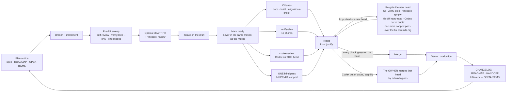

# 🔄 Workflow

How this repo is built, reviewed and merged — a solo maintainer, with **Cowork** (planning, specs) and **Claude Code remote** (implementation), **GitHub Actions** for the mechanical CI and **Vercel** for deploys.

**Who owns what** (one copy of each rule; the others point to it):

- **This file** — the procedure: the loop, the CI lanes, the required check names, the review, the merge ritual (§Review step 5) and the Definition of done.
- **[`CLAUDE.md`](../CLAUDE.md)** — the short-form rules, the owner's words, and pointers here.
- **[`OPEN-ITEMS.md`](OPEN-ITEMS.md) C28** (with C16) — the live branch-protection state and the commands that re-measure it.
- **[`OWNER_RULINGS_2026-10-07.md`](OWNER_RULINGS_2026-10-07.md)** — the owner's decisions (§G: the 2026-10-08 gate decisions).
- **[`ENV.md`](ENV.md)** — env and secrets · **[`HANDOFF.md`](HANDOFF.md)** — current state and the next tasks · **`ROADMAP.md`** · **`CHANGELOG.md`** — history.

## The loop

```mermaid
flowchart LR
  A[Plan a slice<br/>spec · ROADMAP · OPEN-ITEMS] --> B[Branch + implement]
  B --> S[Pre-PR sweep<br/>self-review · verify:slice --only · check:docs]
  S --> C[Open a DRAFT PR<br/>+ '@codex review']
  C --> R[Iterate on the draft]
  R --> M[Mark ready<br/>never in the same motion as the merge]
  M --> P1[CI lanes<br/>docs · build · migrations-check]
  M --> P2[verify-slice<br/>12 shards]
  M --> P3[codex-review<br/>Codex on THIS head]
  M --> P4[ONE blind pass<br/>full PR diff, capped]
  P1 & P2 & P3 & P4 --> T[Triage<br/>fix or justify]
  T -->|fix pushed = a new head| N[Re-gate the new head<br/>CI · verify-slice · '@codex review'<br/>fix diff hand-read · Codex out of quota:<br/>one more capped pass over the fix commits, 5g]
  N --> T
  T -->|every check green on the head| G[Merge]
  T -->|Codex out of quota, step 5g| O[The OWNER merges that head<br/>by admin bypass]
  G --> H[Vercel: production]
  O --> H
  H --> I[CHANGELOG · ROADMAP · HANDOFF<br/>leftovers → OPEN-ITEMS]
  I --> A
```

## Design-thinking prototyping (the standard, owner 2026-10-08)

When the owner asks for design thinking, prototypes or an elevated path, run the loop in
[`.claude/skills/design-prototyping/SKILL.md`](../.claude/skills/design-prototyping/SKILL.md): map the
paths, diverge three directions per moment on the owner's design canvas, ask the owner once, refine with
one consistency pass and an adversarial critic, record it in a docs-only PR (a record, one spec per
moment, OPEN-ITEMS rows naming the stream that builds each), then the blind pass and Codex as below
(step 5(g) when Codex is out of quota), and merge on the owner's go. The worked example is
`docs/PATH_DESIGN_2026-10-07.md` (#319). Streams then build from the record; it wins over a stream card
for the moments it covers.

## Roles

- **Cowork** — break a milestone into slices, write/refresh specs (`docs/`), update `ROADMAP.md`.
- **Claude Code (remote)** — implement on a branch, run the pre-PR sweep, open the PR, run the blind pass, triage the reviews, and merge — on the owner's per-SHA yes (ruling #1's merge-window line) or the owner's explicit instruction to merge that PR — a head whose checks are ALL green (step 5). A head whose `codex-review` is red is merged only by the owner (step 5(g)) (the `.md`-only waiver, under the conditions in WORKFLOW §Review step 5 (f), is the one exception).
- **GitHub Actions** — **mechanical only** (§Gates). `ls .github/workflows` is the whole list — four workflows — and **no token-metered Claude pass runs in CI**: the old review/security/adversarial Actions and their stub checks are retired (`.claude/LEARNINGS.md`, "Reviews run IN-SESSION, not in CI").
- **The reviewers** — an **in-session blind adversarial subagent** and **Codex** (the GitHub app). Neither is a workflow; see §Review.
- **The owner** — the per-SHA merge-window yes or hold (ruling #1) and the admin-bypass merge (step 5(g)); branch protection (C28) is no longer asked of them ("Not necessary", 2026-10-08).
- **Vercel** — preview per PR, production on `main`.

## Branches & PRs

- **Branch:** use the branch the session assigns (it may not follow a pattern). When you create one yourself, `claude/<type>/<slug>`: `<type>` is the conventional-commit type (`feat`/`fix`/`docs`/`chore`/`refactor`/`ci`), `<slug>` is kebab-case with the milestone/phase context — e.g. `claude/feat/m1-p1-session-mint`.
- **One slice = one PR** (small, reviewable), opened as a **draft**: Codex fires when a PR leaves draft or on an explicit `@codex review`, and marking ready and merging in one breath is how a whole round of its findings once landed minutes _after_ the merge, unread (W20/#191 — 2×P1 + 2×P2, all four real).
- **Title:** a conventional-commit summary with milestone context — `feat(qr): M1·P1 session mint`. **Body:** the [PR template](../.github/pull_request_template.md) — link the ROADMAP phase and tick the [`QA-CHECKLIST`](context/QA-CHECKLIST.md) items the change touches in its QA section (that is where QA ticks live now; `docs/REVIEW.md` is the M0→W22 QA log, historical).
- Conventional commits (`feat:`, `fix:`, `chore:`, `docs:`); a `CHANGELOG.md` entry per PR.

## Gates that run in CI (zero tokens)

1. **CI — `ci.yml`, split into lanes** (#320, 2026-10-08) by a `changes` job that every other job reads through a job-level `if` — **never a workflow `paths:` filter**, which would leave a required check pending forever (a job skipped by its `if` reports success; a workflow that never starts reports nothing). Pushes to `main` and manual runs are unfiltered: every lane runs, so a lane mistake on a PR costs a red `main`, never a silent gap.
   - **`docs`** — a PR whose every changed path is `*.md` (any depth) or under `.claude/` — except a `*.test.*` / `*.spec.*` file anywhere, or any path in the sql lane (e.g. `supabase/migrations/NOTES.md`): `pnpm check:docs` + `pnpm format:check`, nothing else. Not `docs/**`, deliberately: a test reads `docs/prototype/v7.2.html` and the menu reference reads `docs/data/*.json`, so any non-`.md` file under `docs/` is code.
   - **`build`** — every other PR: the fast lane (`pnpm check:docs` — GFM table parity + live-state counts re-measured, never transcribed — then the file-read guards, `check:shard-partition` among them), the orphan-suite and test-environment guards, then `pnpm turbo run lint typecheck build test`, then the build-stamp check. Every step carries `if: !cancelled()`, so one red guard no longer hides the rest; a stale doc count still reds the job, so refresh counts on EVERY push.
   - **`migrations-check + types-fresh`** — the sql lane: `supabase/**`, the generated types, the race and authority harnesses, or a workflow file. Boots the local Supabase stack (every migration + seed), proves `packages/db/src/database.types.ts` is not stale, runs **every** `supabase/tests/*.sql`, then the race and mode-authority harnesses. List a load-bearing `.sql` in that step's required-files loop: the glob runs a new file anyway, but only the list makes deleting or renaming it fail the job instead of passing in silence.
   - **`verify-slice`** — the money/authority mutation battery, code lane only, on non-draft PR heads (`ready_for_review` starts it) and pushes to `main`: twelve `verify-slice shard` jobs each run `node scripts/verify-slice.mjs --no-gate --shard=i/12` in their own checkout, and the aggregate `verify-slice` job is the ONE check to require. It is green only when every shard passed, or on a docs-only PR ("not run — docs-only lane"). **A DRAFT is RED on purpose** ("not run — DRAFT"), so a draft-era verdict can never pass for the head being merged.
   - **Measure the steps, never count them from prose:** `grep -nE '^\s+(- )?run: (pnpm (check:|format:)|node scripts/)' .github/workflows/ci.yml`. ⚠️ **`(- )?` is load-bearing (#279):** a step written as a `- name:` block puts its `run:` on a later line with no dash, and the old `- run:` pattern hid exactly `node scripts/check-test-env.mjs`, the guard that refuses a `.test.ts` declaring `@vitest-environment jsdom` (local vitest honours the docblock, so the suite passed here and CI rejected it). The grep still cannot see a `run: |` block (the inline `No orphaned test files` step), and it also matches lines outside the fast lane (the `docs` job's repeats, the shard step, the sql-lane harnesses).
   - **Run them before a push.** `node scripts/check-build-stamp.mjs` reads the BUILD OUTPUT, so run it right after `pnpm turbo … build`. The sql-lane harnesses need `supabase start` (Docker, which the agent environment lacks), but they are not CI-only: run each against the throwaway Supabase-shaped Postgres 16 on `127.0.0.1:54322`, the races with their own `*_ASSUME_DISPOSABLE=1` (LEARNINGS #95 · #243).
2. **`require-docs`** — `require-docs-update.yml`. A PR touching `apps/**` or `packages/**` must also touch `docs/**`, `CHANGELOG.md`, `ROADMAP.md` or `README.md`. Opt out with the `skip-docs` label (sparingly).
3. **`codex-review`** — `require-codex-review.yml`: RED on a ready PR until Codex has reviewed its CURRENT head; `synchronize` re-reds it on every push. It turns green on its own when Codex reports in any of three forms: a review pinned to the head, a no-findings comment naming it ("Reviewed commit: …"), or the **Completed** row for the head in Codex's one summary comment (a clean round Codex starts itself only edits that comment and adds a thumbs-up reaction). The verdict is a check run the `publish-codex-verdict` job CREATES against the head, named `codex-review`; on a draft it stands down green with a summary that says it is **NOT** a statement that the head was reviewed. It has **no lane** — it runs on every PR, `.md`-only included. A gate stuck red after Codex reported: re-run the latest `publish-codex-verdict` run (a human comment no longer re-evaluates it). The decision is `scripts/codex-review-gate.mjs`, tested in `apps/qr/lib/codex-review-gate.test.ts`.
4. **Vercel preview** — `ensure-preview.yml` forces a preview through the Vercel API when the GitHub→Vercel webhook drops a commit (it does, intermittently, for commits pushed from a cloud session). Smoke-test the preview before merging.

**The checks to require on `main` if branch protection is ever wired, by name:** `codex-review` · `verify-slice` · `build` · `migrations-check + types-fresh` · `docs` · `require-docs`. A lane job skipped by its `if` reports success, so no PR waits on a lane it did not run. **Never require:** a `verify-slice shard (N)` leg, `publish-codex-verdict` (green whenever the gate merely evaluates), the retired `codex-reviewed`, or the integration checks `Supabase Preview` / `Vercel Preview Comments`. Such a rule would also block force-pushes to `main`, keep **admin bypass available** (classic rule: leave "Do not allow bypassing the above settings" unticked; ruleset: Repository admin on the bypass list) and **not** require Code Owner review (every PR is authored by the sole code owner, who cannot approve their own PR) — step 5(g) would need both.

**Enforcement today:** none, and none is expected. Measured 2026-10-08 ~07:20Z with an admin-scoped token, `main` had no rule in effect; asked to check it, the owner answered "Not necessary" (2026-10-08), and a re-measure at 11:07Z still read none — so every check stays advisory. C28 ③ holds the commands and the measured state. That token could merge past any red check through the API, so **the merge ritual (step 5) is the only enforcement**.

**Timings** (measured 2026-10-08; re-measure, do not quote): `verify-slice` shards 4.1–10.5 min each over two PR runs, the aggregate ~10.5–11 min wall after `changes`; `build` ~6 min; `migrations-check + types-fresh` 11.1–13.3 min — the critical path whenever the sql lane runs. A full serial local `verify:slice` took 164–180 min (2026-10-06..08), which is why the battery moved into CI (owner: "we can't take more than 30 minutes for each PR merge" — OWNER_RULINGS_2026-10-07 §G, G1).

## Review — in-session, plus Codex

**Do the review before the gate does.** The recurring waste across M1 was shipping a correct-but-incomplete first commit and letting a reviewer tease out the craft round by round (P1.2 took 5 passes). Run the **Pre-PR self-review sweep** in `CLAUDE.md` on your own diff first — money/auth/RLS, a11y, error/recovery paths, copy fidelity — then:

1. **`verify:slice`** — semantic mutations of the money/authority modules (each **must** turn its owning suite red) plus CI's orphan check, zero tokens. Before you push, run `pnpm verify:slice --no-gate --only=<substring>` for each money/authority module you touched (`--list --only=<substring>` shows what a filter selects); the full battery is the CI check (§Gates), so a full local run is not the pre-PR step. Size the battery by measuring it (`pnpm verify:slice --list | wc -l`), never from a number in a doc. Verdicts are CAUGHT · SURVIVED · STALE · UNPARSEABLE · TIMEOUT · ERROR, and only CAUGHT passes: a **surviving** mutant means the fixture is degenerate; a **stale** one is a failure, not a skip; a timeout or a crashed runner is never a kill. A mutant that SURVIVES on one run and is CAUGHT on another of the same tree is a **suite defect** — the suite reads a moment, not history: fix the read, red-first, and never re-run a red `verify-slice` hoping for green (LEARNINGS #248; #324).
2. **`pnpm check:docs`** — table parity + measured counts.
3. **ONE blind adversarial subagent pass over the FULL PR diff** (LEARNINGS #216), started after the mark-ready and run **in parallel with the `verify-slice` check and the Codex round** — it reads `.review-bundle/`, a copy, and the shards mutate their own runners' checkouts, so neither disturbs the other. `pnpm review:bundle` writes `.review-bundle/` — raw diff, full text of every changed file, a heuristic blast radius, and a prompt with no narrative in it. Hand the subagent that directory and nothing else, spawned as `subagent_type: "adversarial-auditor"`. The isolation is the point: an in-context reviewer inherits the author's frame and then confirms it, which is why Codex — who never hears the argument — kept finding what the in-session pass missed. **HARD CAP** (owner directive, 2026-08-05; re-affirmed 2026-10-04): the full PR diff and never deeper, **≤3 lenses**, **≤10 agents**, **~15 min**. If it stalls or overruns, kill it and hand-triage its partial output — never relaunch. Every finding is **verified against source before you act on it**; a right conclusion with an invented mechanism is worse than no finding, because the mechanism is what gets believed. After applying fixes: mechanical gates + a hand-read of the fix diff, **never another agent round**. A further pass is earned only when Codex's round on the head comes back RED — one more capped pass over the files Codex named, never a fleet (LEARNINGS #218) — or, with Codex out of quota, when fixes are pushed after the pass: one more capped pass over exactly those fix commits, the last agent round (owner, 2026-10-08: "Yes one more"; step 5(g)). Post the verdict as a PR comment naming the head SHA it reviewed.
4. **Two Codex rounds, then merge** (owner, 2026-08-16: "When diminishing returns after round 2, should note for nice to-dos and merge"). Comment `@codex review` on the draft immediately after opening; round 2 on the fix commits. Fix-or-justify every finding in both. From round 3 on, fix-on-sight trivia may still land in one small commit, but anything else — polish, edge-case copy, shrinking-materiality nits — goes to `docs/OPEN-ITEMS.md` and **the PR merges**. The loop converges; it never terminates on its own (W22a/#194 ran 4 rounds: 4 → 5 → 1 → 2 findings, each real but each smaller). The budget bounds how many rounds are TRIAGED, not how many exist: the last push before a merge always needs one more round on its head (5(c)). A request Codex answers with its usage-limit message is no round at all: step 5(g).
5. **The merge ritual — mark-ready and merge are NEVER one motion.** Each step is gated on the one before:
   - **(a)** final push, local gates green;
   - **(b)** mark ready for review;
   - **(c)** `@codex review` (the ready-for-review event usually fires it, but the last push before a merge always needs a round on THAT head);
   - **(d)** **WAIT** until the `codex-review` check is green **with a summary that says "Codex has reviewed" the merge head SHA** — the exact assertion matters, because the DRAFT STAND-DOWN check is also green and also names the SHA while stating the opposite ("NOT a statement that … has been reviewed"), and on a mark-ready with no new push that stand-down is still standing until the `ready_for_review` run replaces it: green-plus-SHA alone would wave you through the exact race this ritual exists to stop. **And WAIT until the `verify-slice` check is green on that same head** (the mark-ready starts its shards, overlapping the Codex wait). Event-driven: subscribe to the PR and act on the wake; never sleep-poll, never re-arm a timed self-check (`send_later` / cron) on a PR that is only waiting — a PARKED PR waits on EVENTS alone (owner, 2026-09-15; LEARNINGS #114) — and never read the job's own always-green check as the verdict. If Codex answers with its usage-limit message, do not re-ask until the quota is back; go to (g). If Codex's comments on the PR carry that usage-limit message for this head, treat a green `codex-review` as unproven — no review happened — and go to (g) (the gate is not yet tested against a quota-limited summary, OPEN-ITEMS T53 ②);
   - **(e)** fetch the round (`pull_request_read` → get_reviews / get_review_comments / get_comments) and fix-or-justify. A clean round Codex started itself shows only as its summary comment's Completed row for the head, so an empty review list is then the round, not a missing one. **If any fix is PUSHED, that push is a new head: `synchronize` reddens `codex-review` on it and re-runs `verify-slice`, so loop back to (c)/(d) for the new head before going further;**
   - **(f)** merge — on the owner's per-SHA yes (ruling #1's merge-window line) or the owner's explicit instruction to merge that PR, and only ever a head whose own reviewed verdict AND own `verify-slice` (and the rest of CI) are green. **How an agent applies ruling #1's `.md`-only waiver** (the owner's words: "`.md`-only PRs merge without the Codex wait this wave (CI green still required). CLAUDE.md and `.claude/**` are excluded: they need the per-SHA line." — the lead's tightening, confirmed by the owner 2026-10-08): only when Codex is out of quota (with quota, every PR waits for Codex); only while `codex-review` is not a required check, re-measured immediately before the merge with OPEN-ITEMS C28 ③'s reads, their output quoted in the PR; and never for a PR that touches the rules governing merges — `CLAUDE.md`, `.claude/**`, `docs/WORKFLOW.md`, `docs/OWNER_RULINGS_*.md`, OPEN-ITEMS C16/C28, `.github/**` — which need the owner's per-SHA line. It is the one exception to "never merges a red `codex-review`";
   - **(g)** **Codex out of quota** (owner, 2026-10-08: "codex-review can be replaced with blind review if out of quota so merge is not blocked waiting on quota", then "go with the manual admin bypass for quota" — [OWNER_RULINGS_2026-10-07](OWNER_RULINGS_2026-10-07.md) §G, G3). When Codex answers a review request with its usage-limit message ("You have reached your Codex usage limits for code reviews"), the capped blind adversarial review (step 3) of the EXACT head stands in for Codex: post its verdict on the PR naming that head SHA, with `verify-slice` and the rest of CI green on the same SHA. That head is the PR's head as GitHub reports it (`head.sha`), checked against the bundle's before posting — never the local checkout's, which another checkout's push leaves stale — and a verdict other than APPROVE stands in only once every finding is fixed or justified on the PR. The **OWNER** then merges that head with GitHub's admin bypass, by hand (while no protection rule is in effect — "Not necessary", 2026-10-08 — that is a plain merge: there is nothing to bypass). An agent never merges a head whose `codex-review` is red (the `.md`-only waiver, under the conditions in WORKFLOW §Review step 5 (f), is the one exception) — even though its admin-scoped token could — and never automates the bypass (an automated version, the gate accepting a verdict comment posted from the owner's account, was refused as a CI bypass: the agent posts AS the owner and would satisfy its own required check). The bypass covers a red `codex-review` only — never `verify-slice`, `build`, `docs`, `migrations-check + types-fresh` or `require-docs`. **A fix pushed after the capped pass** (owner, 2026-10-08: "Yes one more" — asked whether such a fix is carried by the author's hand-read or gets one more capped pass scoped to the fix commits): ONE more capped blind pass runs over exactly those commits — `pnpm review:bundle --base <the SHA the first pass reviewed>` on a checkout of the PR's final head as GitHub reports it, under the same cap as any pass (≤3 lenses, ≤10 agents, ~15 min). Its verdict, posted naming the final head SHA and the base it reviewed from, is the stand-in for that head; a verdict other than APPROVE stands in only once every finding is fixed or justified on the PR. It is the last agent round, and an owner-made exception to the HARD CAP's "never another agent round" — only when Codex is out of quota (with quota, Codex's round on the final head covers the fix commits). _The lead's procedure (2026-10-08, not an owner ruling — the owner may require more):_ a fix pushed after that second pass is carried by the author's hand-read of the commits after it, posted as ONE comment naming the final head SHA. The merge-window line for that head lists those fix commits and says whether any touches a `MONEY_PATHS` file (`scripts/check-money-coverage.mjs`), so the owner bypass-merges knowing which commits no blind reviewer read.

   **Why (d) is a step, not a nicety:** #241 was squash-merged eleven seconds after `codex-review` went red on its head — by the session that built the gate the PR before — and a money-path commit reached `main` unreviewed; #242, the same afternoon, ran the ritual and held red four minutes until Codex reported (LEARNINGS #61).

   **The standing rulings beside it** ([OWNER_RULINGS_2026-10-07](OWNER_RULINGS_2026-10-07.md)): the owner answers one merge-window message listing each ready PR as `#N @ head SHA`, with its blind-pass verdict link and the `verify-slice` CI check green on that SHA, yes or hold per line; a yes covers only that SHA (#1). A money-path PR the blind pass flagged keeps ruling #1's default: it waits for Codex's review of its head unless the owner overrides that line; with Codex out of quota, the owner's override is their own bypass merge. **#1's `.md`-only waiver:** how an agent applies it is step (f). If `codex-review` is ever required, such a PR is red on it too (it has no lane) and is listed `#N @ SHA · .md-only` for the owner's same bypass (#2). A rebase that changes only the measured-count lines `pnpm check:docs` names keeps the owner's yes, provided `git range-diff <old-base>..<yes'd SHA> <new-base>..<new head>` shows only those count lines and CI is green on the new head (§D).

Codex is a second independent reviewer, not a substitute for the in-session pass — the converse holds only under step 5(g), where the blind pass of the exact head stands in for Codex. Triaging Codex's findings is a hand-read; it does **not** spend another agent round.

## Tracking

- [`docs/OPEN-ITEMS.md`](OPEN-ITEMS.md) — the single open-work registry (IDs never change). Every PR sweeps it: close, retire, or add the items your change touched.
- [`docs/HANDOFF.md`](HANDOFF.md) — the current state and the next tasks.
- `ROADMAP.md` — the plan and its ticked history (append-only). `CHANGELOG.md` — one entry per PR.

## Secrets & tokens

- **App env** lives only in Vercel (scoped Production/Preview/Development) and GitHub Actions secrets — **never in git** (`.gitignore` covers `.env*`). The wiring map is [`docs/ENV.md`](ENV.md).
- **CI's only secret:** `VERCEL_TOKEN`, plus the `VERCEL_PROJECT_ID` / `VERCEL_TEAM_ID` / `VERCEL_REPO_ID` / `VERCEL_PROJECT_NAME` repo vars for the preview safety net (optional; `ensure-preview.yml` no-ops without them). No Claude API token — nothing metered runs in CI.

## Definition of done (per slice)

The `verify-slice` check green on the merge head (and `--only=` runs for what you touched, before the push) · `pnpm check:docs` green · CI green on the merge head · the blind-pass verdict posted, naming the head it reviewed, and its findings fixed or justified · **both Codex rounds** fixed-or-justified and `codex-review` green on the merge head — or, with Codex out of quota, step 5(g): the blind-pass verdict on that head and the owner's admin-bypass merge of that SHA · the QA-checklist items the change touches ticked in the PR body (`docs/context/QA-CHECKLIST.md`) · `ROADMAP.md` box checked · `CHANGELOG.md` line added · `docs/OPEN-ITEMS.md` swept · preview smoke-tested · merged to `main` · production deploy verified. Learned something non-obvious? Append it to `.claude/LEARNINGS.md`.
